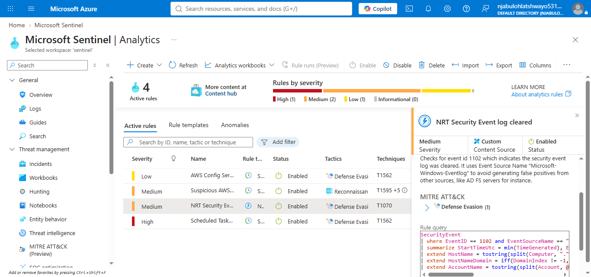

# Microsoft Sentinel – Analytics Rules

## Business Objective

The purpose of this implementation was to configure, validate, and document Microsoft Sentinel Analytics Rules used to detect suspicious activity across the monitored environment.

This implementation demonstrates practical detection engineering using Microsoft Sentinel by validating existing detections and deploying a custom Analytics Rule capable of generating security alerts and incidents.

---

# Technologies

* Microsoft Sentinel
* Microsoft Azure
* Kusto Query Language (KQL)
* Windows Security Events
* MITRE ATT&CK Framework

---

# Data Sources

* SecurityEvent
* AzureActivity_CL
* OfficeActivity_CL
* CommonSecurityLog
* AWSCloudTrail
* CrowdStrikeDetections
* CrowdStrikeAlerts
* OktaV2_CL

---

# Existing Analytics Rules

The following Analytics Rules were verified during the implementation.

| Rule Name                                     | Type           | Severity | Status  |
| --------------------------------------------- | -------------- | -------- | ------- |
| AWS Config Service Resource Deletion Attempts | Scheduled      | Low      | Enabled |
| Suspicious AWS CLI Command Execution          | Scheduled      | Medium   | Enabled |
| NRT Security Event Log Cleared                | Near Real-Time | Medium   | Enabled |
| Scheduled Task...                             | Scheduled      | High     | Enabled |

---

# Custom Analytics Rule

**Rule Name**

Multiple Failed Windows Logons

**Detection Type**

Scheduled Query Rule

**Severity**

Medium

**Data Source**

SecurityEvent

**MITRE ATT&CK**

* Credential Access (TA0006)
* Brute Force (T1110)

---

# Detection Logic

The custom detection monitors Windows Security Event **4625** to identify repeated failed Windows authentication attempts.

The query records:

* Account
* Computer
* Failed Logons
* First Seen
* Last Seen

The Analytics Rule generates a Microsoft Sentinel alert whenever the configured threshold is met.

---

# Validation

The custom KQL query successfully detected multiple Windows accounts generating repeated failed logon events.

Examples included:

* ADMINISTRATOR
* admin
* administrator
* VADMIN
* SHIR-Hive\admin

The Analytics Rule was successfully deployed and enabled within Microsoft Sentinel.

---

# Evidence

## Figure 1 – Analytics Rules Overview


The Microsoft Sentinel Analytics Rules dashboard showing active rules, severity, MITRE ATT&CK mappings, and operational status.

---

## Figure 2 – Built-in Analytics Rule



Configuration of the built-in **NRT Security Event Log Cleared** Analytics Rule.

---

## Figure 3 – Custom KQL Validation


Validation of the custom KQL query showing multiple failed Windows logon attempts detected from the **SecurityEvent** table.

---

## Figure 4 – Custom Rule General Configuration


General configuration page showing the rule name, description, severity, and MITRE ATT&CK mapping.

---

## Figure 5 – Rule Logic Configuration


Configuration of the detection logic, KQL query, scheduling interval, and alert threshold.

---

## Figure 6 – Incident Settings


Configuration used to automatically generate Microsoft Sentinel incidents from alerts.

---

## Figure 7 – Automation Configuration


Automation configuration showing that no playbooks or automation rules were attached during the initial deployment.

---

## Figure 8 – Review and Create


Final review page before deploying the custom Analytics Rule.

---

## Figure 9 – Custom Analytics Rule Created


Confirmation that the custom Analytics Rule was successfully created and enabled.

---

# Skills Demonstrated

* Microsoft Sentinel Administration
* Detection Engineering
* Kusto Query Language (KQL)
* Analytics Rule Development
* Windows Security Event Analysis
* MITRE ATT&CK Mapping
* Security Monitoring
* SOC Detection Validation

---

# Repository Structure

```text
analytics-rules/
│
├── configuration/
├── detections/
├── notes/
├── queries/
├── screenshots/
├── validation/
└── README.md
```

---

# Outcome

This implementation demonstrates the complete lifecycle of detection engineering within Microsoft Sentinel, including detection design, KQL development, validation, Analytics Rule deployment, and documentation. The guide provides a repeatable approach for developing future detections across the SOC Platform Build.
