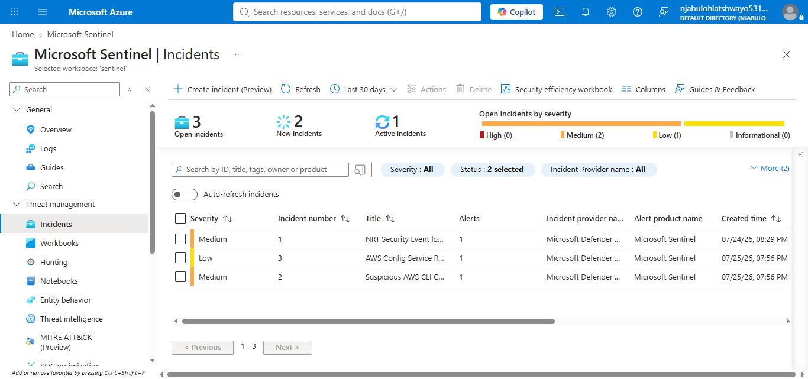
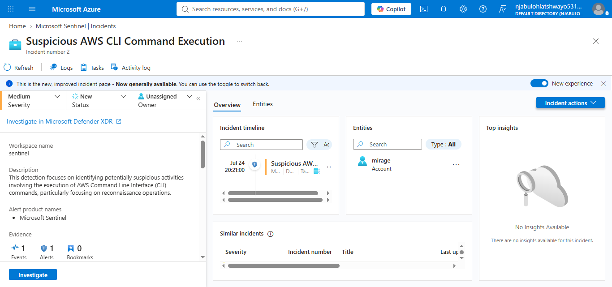
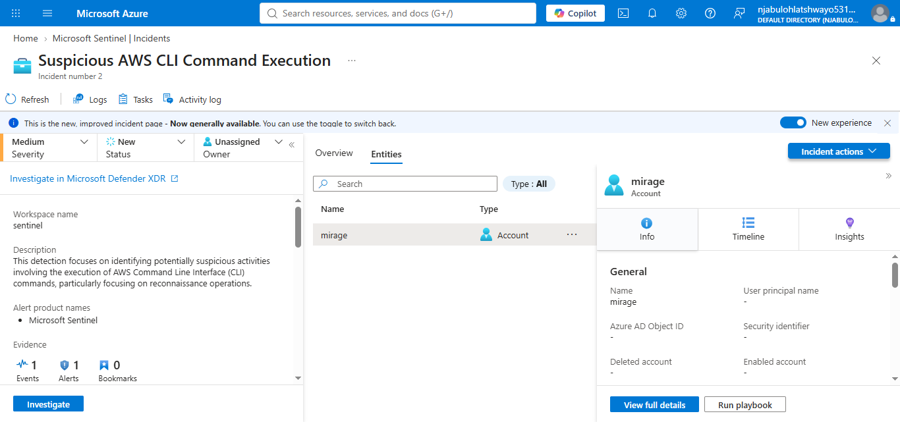
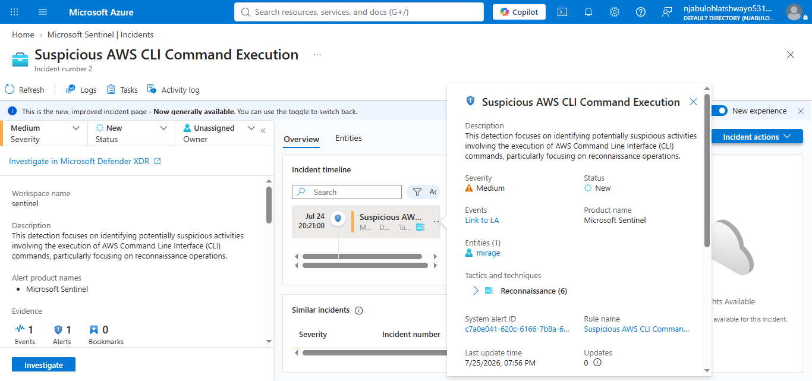
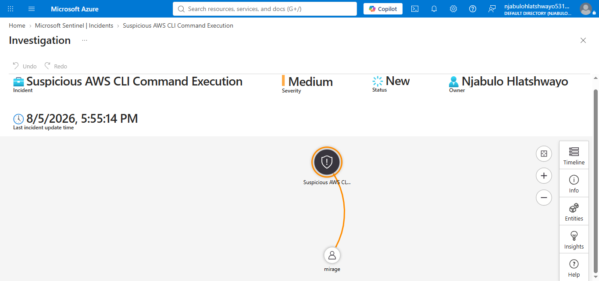

# Microsoft Sentinel – Incident Investigation

## Project Overview

This implementation demonstrates the investigation of a Microsoft Sentinel security incident using the modern Incident Investigation experience. The investigation focused on analyzing a real security alert, reviewing incident details, examining associated entities, and understanding the attack techniques identified by Microsoft Sentinel.

---

## Objectives

* Investigate a Microsoft Sentinel incident.
* Review incident metadata.
* Analyze associated entities.
* Understand MITRE ATT&CK mapping.
* Review incident timeline.
* Document the investigation process.

---

## Technologies Used

* Microsoft Sentinel
* Microsoft Azure
* Incident Management
* MITRE ATT&CK Framework
* Security Operations Center (SOC)

---

## Investigation Steps

### 1. Incident Queue

The Microsoft Sentinel Incidents workspace was reviewed to identify available security incidents. Multiple incidents were available for investigation, including a medium-severity incident titled **Suspicious AWS CLI Command Execution**.



---

### 2. Incident Overview

The incident overview provided key information including the incident severity, status, owner, description, and incident timeline. The alert described suspicious execution of AWS Command Line Interface (CLI) commands associated with reconnaissance activity.



---

### 3. Entity Analysis

The investigation identified a single related entity:

* **Account:** mirage

The entity details provided account information and allowed additional investigation through Microsoft Sentinel.



---

### 4. Incident Details

Additional investigation identified important security information including:

* MITRE ATT&CK Tactic
* Reconnaissance
* Rule Name
* System Alert ID
* Timeline
* Related Entity

These details help analysts understand the nature of the detected activity and support further investigation.



---

### 5. Investigation Workspace

The investigation continued using Microsoft Sentinel's built-in investigation capabilities to support additional analysis of the incident and related entities.



---

## Skills Demonstrated

* Microsoft Sentinel Incident Investigation
* SOC Incident Analysis
* Entity Investigation
* MITRE ATT&CK Analysis
* Security Event Analysis
* Incident Documentation

---

## Repository Structure

```text
incident-investigation/
├── configuration/
├── notes/
├── screenshots/
├── validation/
└── README.md
```

---

## Outcome

The investigation successfully demonstrated how Microsoft Sentinel supports SOC analysts during incident response. By reviewing incident metadata, examining associated entities, understanding MITRE ATT&CK mappings, and analyzing investigation details, analysts can efficiently triage and investigate security events. This implementation provides a practical example of a real Microsoft Sentinel incident investigation workflow.

