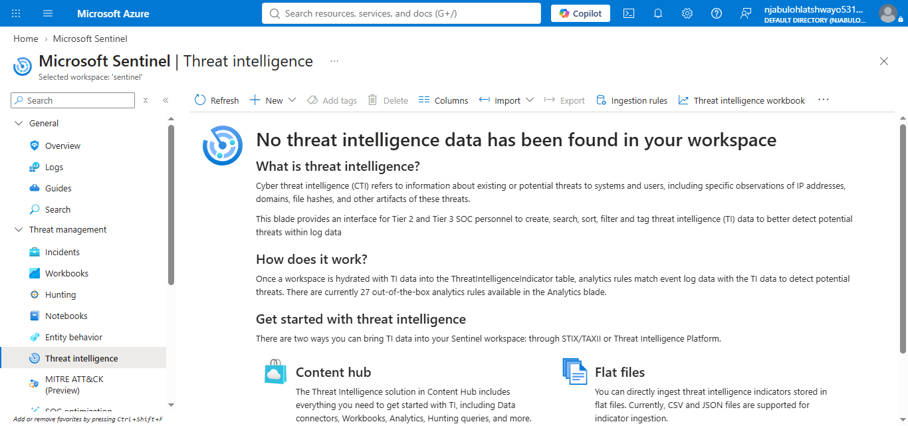
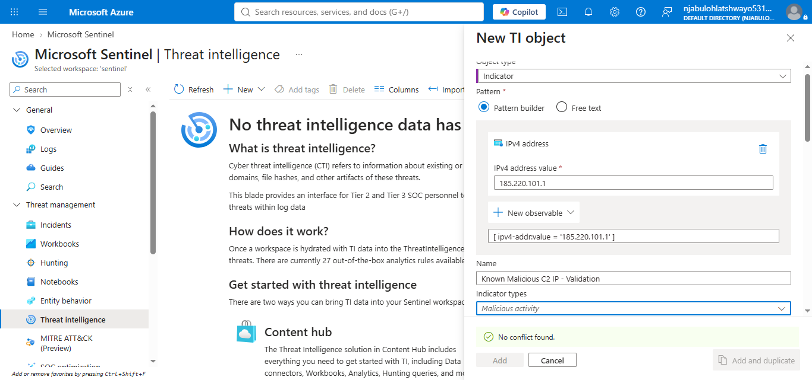
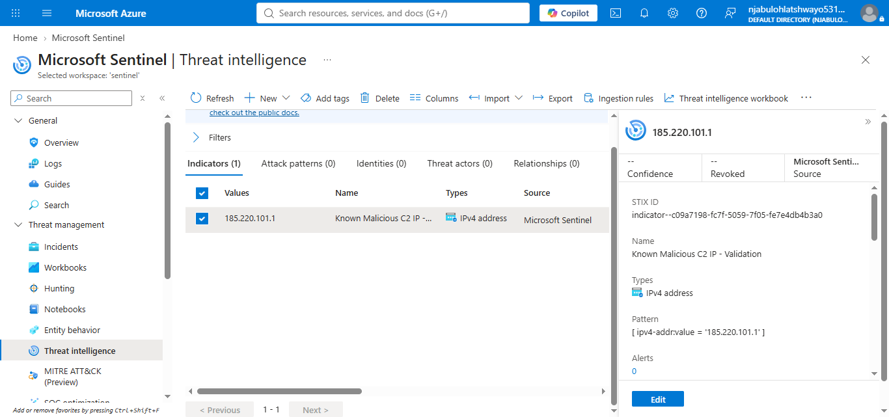
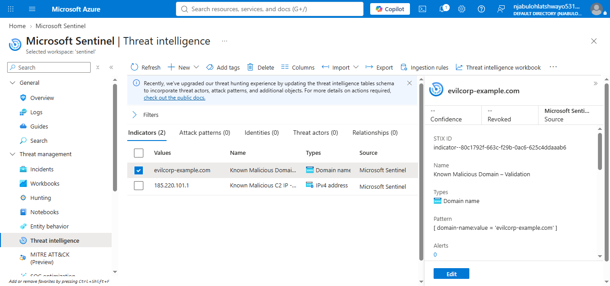
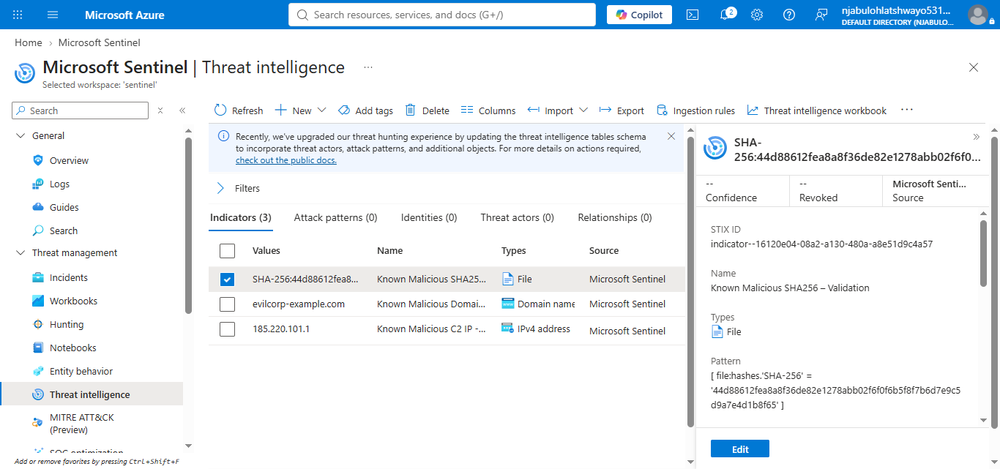
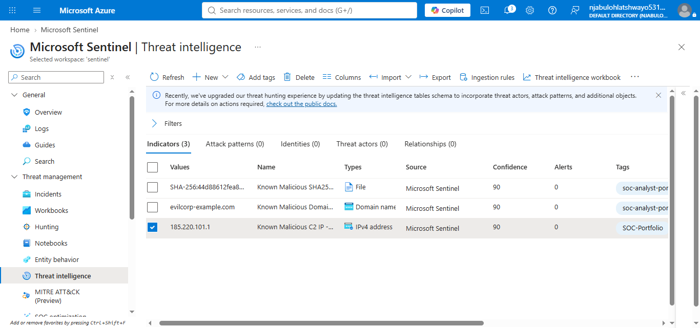
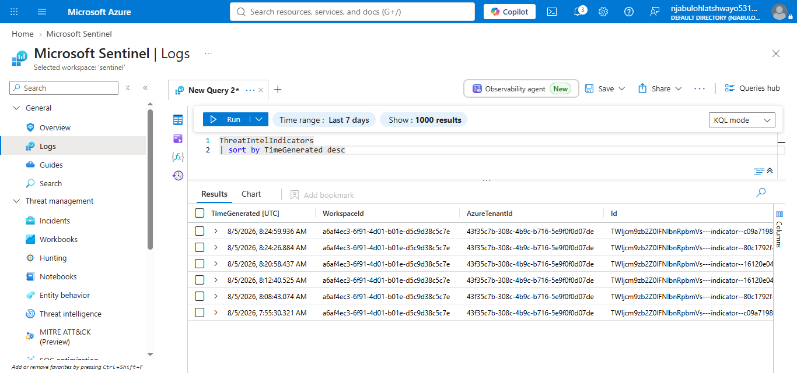

# Microsoft Sentinel – Threat Intelligence Implementation

## Project Overview

This implementation demonstrates the deployment and management of Threat Intelligence within Microsoft Sentinel using the STIX 2.1 Threat Intelligence model. The project focuses on creating, managing, and validating Indicators of Compromise (IOCs) that can later be used for threat detection, investigation, and incident response.

---

## Objectives

* Explore the Microsoft Sentinel Threat Intelligence workspace.
* Create STIX 2.1 Threat Intelligence objects.
* Create manual Indicators of Compromise (IOCs).
* Manage Threat Intelligence indicators.
* Validate the implementation using Microsoft Sentinel.
* Document the complete implementation process.

---

## Technologies Used

* Microsoft Sentinel
* Microsoft Azure
* Log Analytics Workspace
* Threat Intelligence
* STIX 2.1
* Kusto Query Language (KQL)

---

## Implementation Steps

### 1. Threat Intelligence Overview

The Microsoft Sentinel Threat Intelligence workspace was reviewed to understand the available functionality for creating and managing Threat Intelligence objects.



---

### 2. Creating a Manual Threat Intelligence Indicator

A new Threat Intelligence Indicator was created using the STIX 2.1 interface.



---

### 3. Creating an IPv4 Indicator

A malicious IPv4 Indicator of Compromise was manually created. The indicator included confidence scoring, severity, expiration date, and supporting metadata.



---

### 4. Creating a Domain Indicator

A malicious domain IOC was added to the Threat Intelligence repository using the same STIX workflow.



---

### 5. Creating a SHA-256 File Hash Indicator

A SHA-256 hash IOC was manually created to demonstrate support for file-based threat intelligence.



---

### 6. Threat Intelligence Repository

After creating the indicators, Microsoft Sentinel displayed them within the Threat Intelligence repository for centralized management.



---

### 7. Threat Intelligence Validation

The Threat Intelligence implementation was validated by querying the Threat Intelligence table within Microsoft Sentinel Logs to verify that the indicators were available for future detection and investigation workflows.



---

## Skills Demonstrated

* Microsoft Sentinel Administration
* Threat Intelligence Management
* STIX 2.1 Indicator Creation
* Indicator of Compromise (IOC) Management
* Security Operations Center (SOC) Documentation
* Microsoft Sentinel Threat Intelligence
* Kusto Query Language (KQL)
* Security Documentation

---

## Repository Structure

```text
threat-intelligence/
├── configuration/
├── indicators/
├── notes/
├── queries/
├── screenshots/
├── validation/
└── README.md
```

---

## Outcome

This implementation successfully demonstrated the deployment and management of Microsoft Sentinel Threat Intelligence using the modern STIX 2.1 framework. Multiple IOC types were created, managed, and validated, providing a reusable Threat Intelligence foundation that can be integrated into future analytics rules, automation workflows, investigations, and incident response activities.
