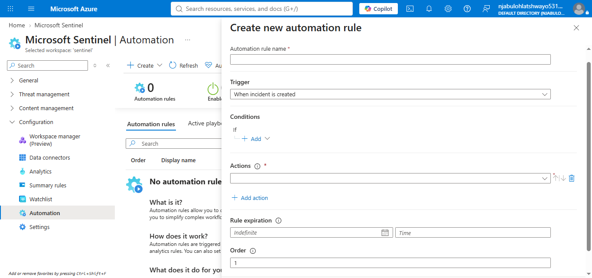
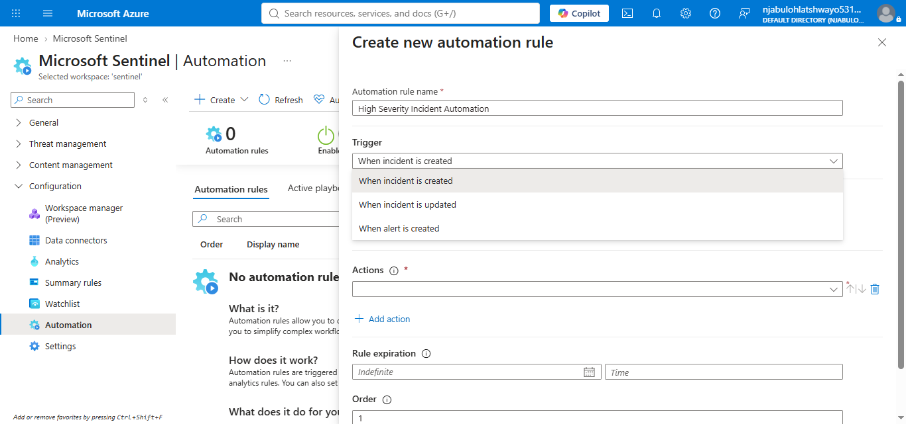
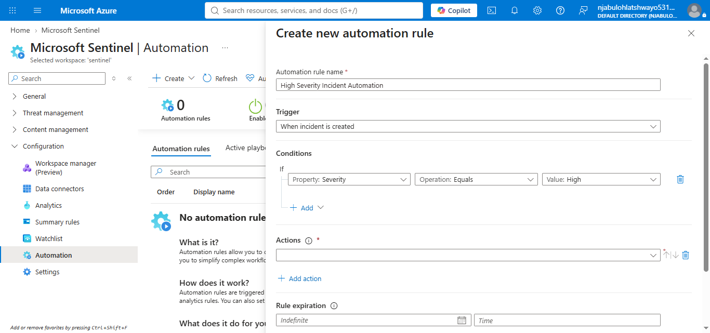
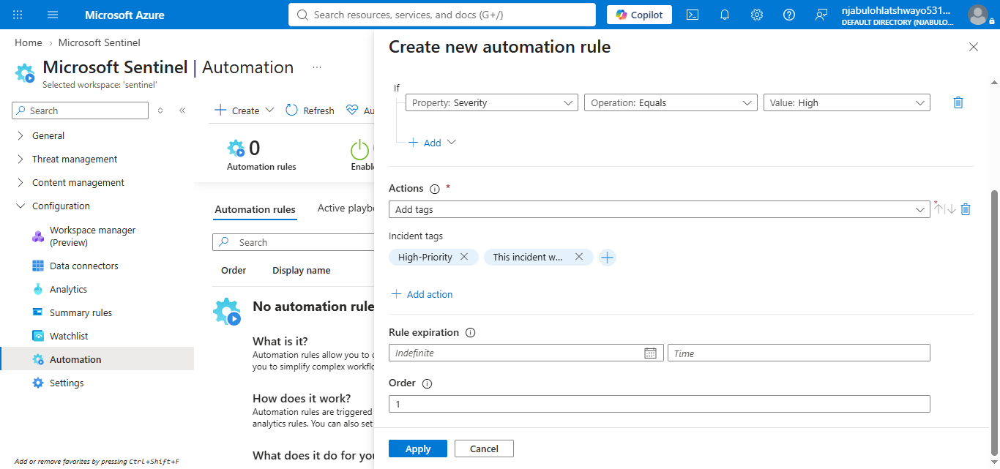
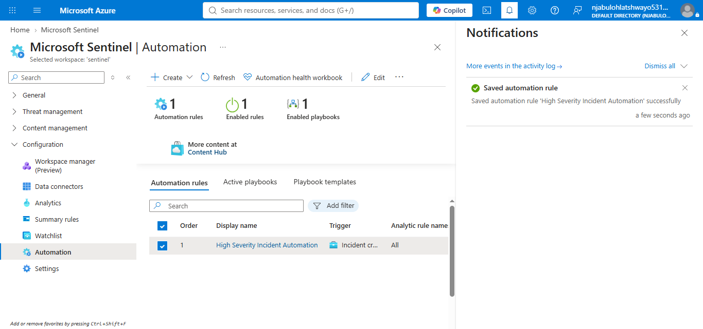
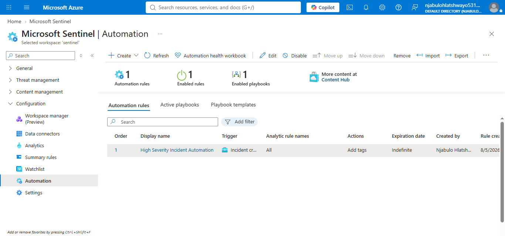

# Microsoft Sentinel – Automation

## Project Overview

This implementation demonstrates how Microsoft Sentinel Automation Rules improve Security Operations Center (SOC) efficiency by automatically performing predefined actions when incidents are created. Automation Rules reduce repetitive manual work, improve consistency, and help analysts respond more quickly to high-priority security incidents.

---

## Objectives

* Explore Microsoft Sentinel Automation.
* Create an Automation Rule.
* Configure incident triggers.
* Configure automation conditions.
* Configure automated actions.
* Validate successful rule creation.
* Document the implementation process.

---

## Technologies Used

* Microsoft Sentinel
* Microsoft Azure
* Automation Rules
* Security Operations Center (SOC)
* Incident Management

---

## Implementation Steps

### 1. Create Automation Rule

A new Automation Rule named **High Severity Incident Automation** was created within Microsoft Sentinel.



---

### 2. Configure Incident Trigger

The Automation Rule was configured to execute whenever a new incident is created.



---

### 3. Configure Rule Conditions

A condition was added so the automation executes only when the incident severity is **High**.



---

### 4. Configure Automation Actions

The Automation Rule automatically:

* Adds the **High-Priority** tag.
* Adds an analyst comment indicating that the incident was automatically processed.



---

### 5. Review and Create

The Automation Rule configuration was reviewed before deployment.



---

### 6. Validate Automation Rule

The completed Automation Rule was successfully saved and appeared in the Microsoft Sentinel Automation Rules workspace.



---

## Skills Demonstrated

* Microsoft Sentinel Administration
* Automation Rules
* Security Automation
* Incident Management
* SOC Operations
* Workflow Automation
* Security Documentation

---

## Repository Structure

```text
automation/
├── configuration/
├── rules/
├── playbooks/
├── queries/
├── validation/
├── notes/
├── screenshots/
└── README.md
```

---

## Outcome

The implementation successfully demonstrated the creation and deployment of a Microsoft Sentinel Automation Rule. The rule automatically responds to newly created high-severity incidents by applying a priority tag and adding a standardized analyst comment. This implementation illustrates how automation can improve operational consistency, reduce manual effort, and support faster incident response within a Security Operations Center.
