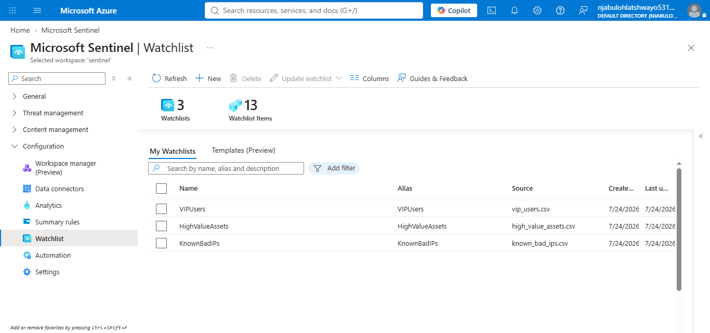
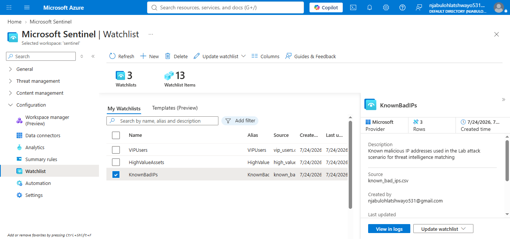
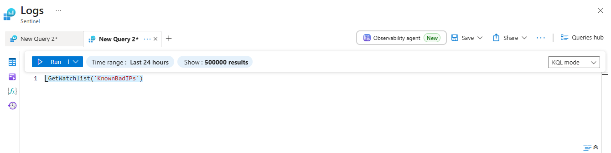
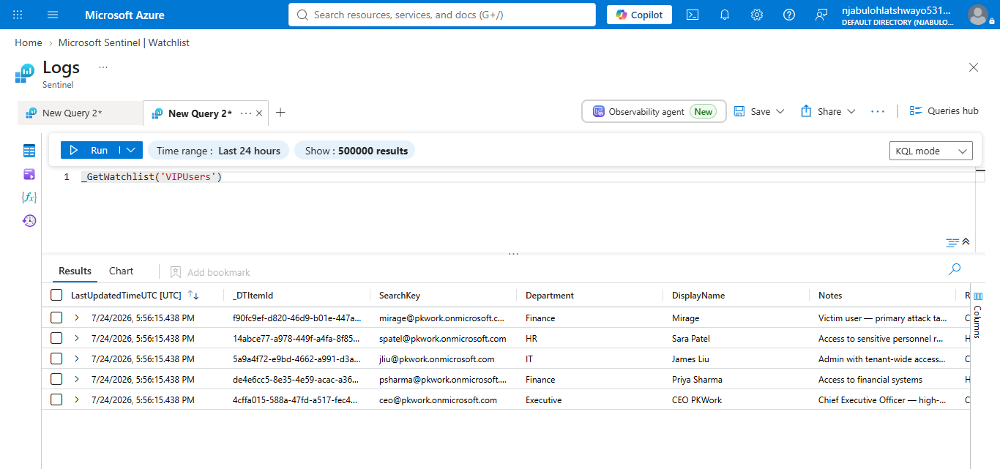
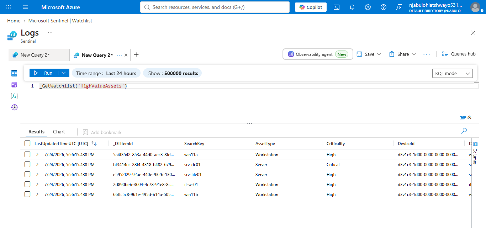

# Microsoft Sentinel – Watchlists

## Project Overview

This implementation demonstrates how Microsoft Sentinel Watchlists can be used to enrich investigations, improve threat hunting, and support Security Operations Center (SOC) operations. Three watchlists were reviewed during this implementation: **VIPUsers**, **HighValueAssets**, and **KnownBadIPs**. These watchlists provide contextual information that can be referenced from KQL queries, analytics rules, automation workflows, and incident investigations.

---

## Objectives

* Explore Microsoft Sentinel Watchlists.
* Review existing watchlists.
* Understand watchlist configuration.
* Query watchlists using Kusto Query Language (KQL).
* Validate watchlist accessibility.
* Document the implementation.

---

## Technologies Used

* Microsoft Sentinel
* Microsoft Azure
* Watchlists
* Log Analytics
* Kusto Query Language (KQL)
* Security Operations Center (SOC)

---

## Implementation Steps

### 1. Review Available Watchlists

The Watchlists workspace was reviewed to identify the available watchlists configured within Microsoft Sentinel.

Available watchlists included:

* VIPUsers
* HighValueAssets
* KnownBadIPs



---

### 2. Review Watchlist Configuration

The **KnownBadIPs** watchlist was opened to review its configuration and metadata.

The watchlist contained:

* Description
* Source CSV file
* Provider
* Row count
* Creation date



---

### 3. Query KnownBadIPs

The watchlist was queried from Log Analytics using the Microsoft Sentinel watchlist function.

```kusto
_GetWatchlist('KnownBadIPs')
```



---

### 4. Query VIP Users

The **VIPUsers** watchlist was queried to verify that privileged user information could be retrieved.

```kusto
_GetWatchlist('VIPUsers')
```



---

### 5. Query High Value Assets

The **HighValueAssets** watchlist was queried to validate access to critical asset information.

```kusto
_GetWatchlist('HighValueAssets')
```



---

### 6. Validate Watchlist Queries

The Log Analytics workspace successfully executed the watchlist queries using the `_GetWatchlist()` function, confirming that each watchlist was available for use in investigations and analytics.


---

## Skills Demonstrated

* Microsoft Sentinel Administration
* Watchlist Management
* Kusto Query Language (KQL)
* Threat Hunting Preparation
* Investigation Enrichment
* SOC Documentation

---

## Repository Structure

```text
watchlists/
├── configuration/
├── management/
├── notes/
├── queries/
├── screenshots/
├── validation/
└── README.md
```

---

## Outcome

The implementation successfully demonstrated how Microsoft Sentinel Watchlists can store and retrieve contextual security information. By querying watchlists through Log Analytics, analysts can enrich investigations, improve threat hunting, and integrate watchlist data into analytics rules and automation workflows. This implementation provides a practical foundation for using watchlists within a modern Security Operations Center.

