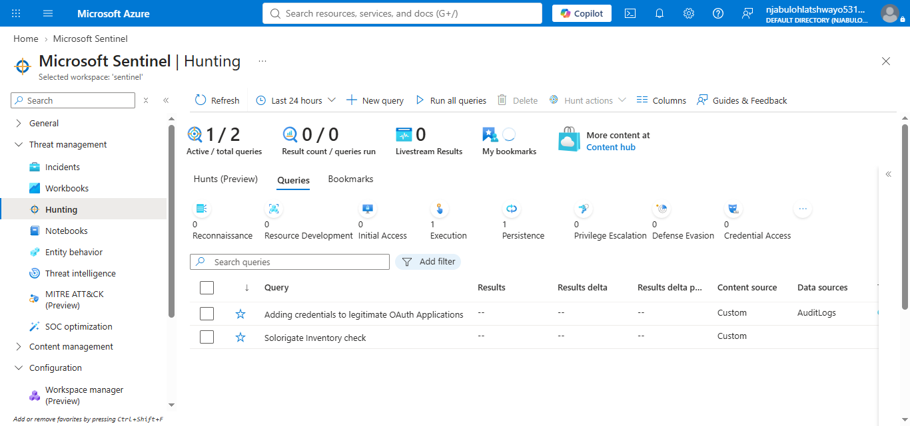
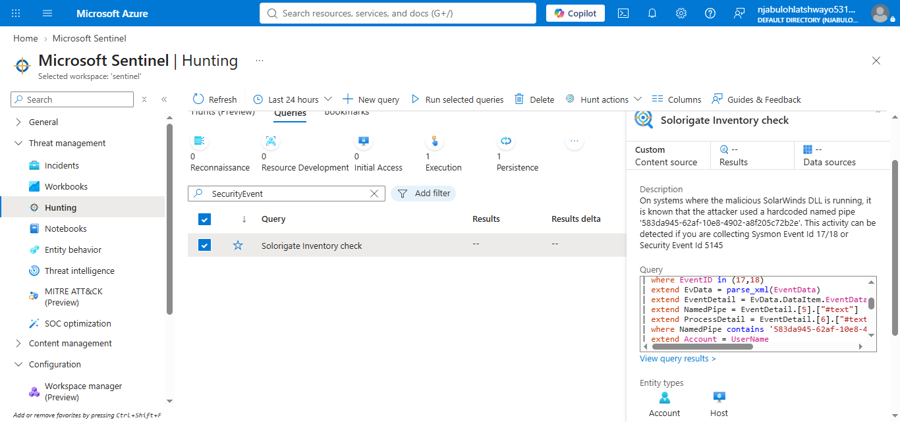
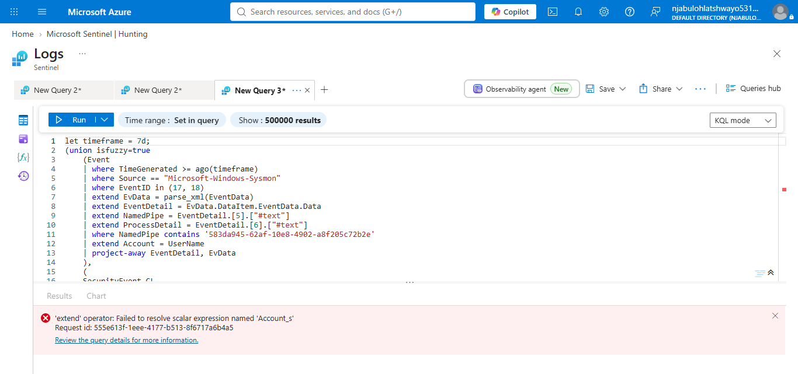

# Microsoft Sentinel – Hunting

## Project Overview

This implementation explores the Microsoft Sentinel Hunting capability used by Security Operations Center (SOC) analysts to proactively search for suspicious activity that may not generate alerts or incidents. During this implementation, the Hunting workspace was reviewed, a custom hunting query was examined, and the query execution was validated.

---

## Objectives

* Explore the Microsoft Sentinel Hunting workspace.
* Review available hunting queries.
* Understand hunting query metadata.
* Execute a hunting query.
* Validate hunting functionality.
* Document the implementation.

---

## Technologies Used

* Microsoft Sentinel
* Microsoft Azure
* Log Analytics
* Kusto Query Language (KQL)
* Microsoft Sentinel Hunting
* Security Operations Center (SOC)

---

## Implementation Steps

### 1. Explore the Hunting Workspace

The Microsoft Sentinel Hunting page was reviewed to identify available hunting queries and understand the hunting interface.

**Screenshot**



---

### 2. Review Available Hunting Queries

The workspace contained one custom hunting query:

* **Solorigate Inventory check**

The query is designed to identify activity associated with the SolarWinds (Solorigate) attack by searching for known indicators within collected security logs.

**Screenshot**


---

### 3. Review Hunting Query Details

The hunting query was examined before execution.

Key information included:

* Query Name: Solorigate Inventory check
* Content Source: Custom
* Entity Types:

  * Account
  * Host
* MITRE ATT&CK Tactic:

  * Execution

The query searches for activity related to known Solorigate attack techniques.

**Screenshot**



---

### 4. Execute the Hunting Query

The hunting query was executed from the Microsoft Sentinel Hunting workspace.

During execution, Microsoft Sentinel returned the following error:

> **'extend' operator: Failed to resolve scalar expression named 'Account_s'**

The error indicates that the query references a field that does not exist in the current Microsoft Sentinel lab environment.

This represents a schema mismatch rather than a Microsoft Sentinel platform failure.

**Screenshot**



---

## Findings

The implementation confirmed that:

* Microsoft Sentinel Hunting was successfully configured.
* The Hunting workspace was accessible.
* A custom hunting query was available.
* Query metadata could be reviewed successfully.
* Query execution identified a schema mismatch with the current lab dataset.

---

## Skills Demonstrated

* Microsoft Sentinel Hunting
* Hunting Query Analysis
* Kusto Query Language (KQL)
* Query Validation
* Troubleshooting Schema Errors
* SOC Documentation

---

## Repository Structure

```text
hunting/
├── bookmarks/
├── configuration/
├── notes/
├── queries/
├── screenshots/
├── validation/
└── README.md
```

---

## Outcome

This implementation demonstrated how Microsoft Sentinel Hunting enables analysts to proactively search for suspicious activity using KQL-based hunting queries. Although the provided custom query could not execute because the expected **Account_s** field was not present in the current lab dataset, the investigation successfully validated the hunting workflow, reviewed query metadata, and documented the schema mismatch. This reflects a realistic SOC scenario where analysts must identify and troubleshoot data source differences between environments.

