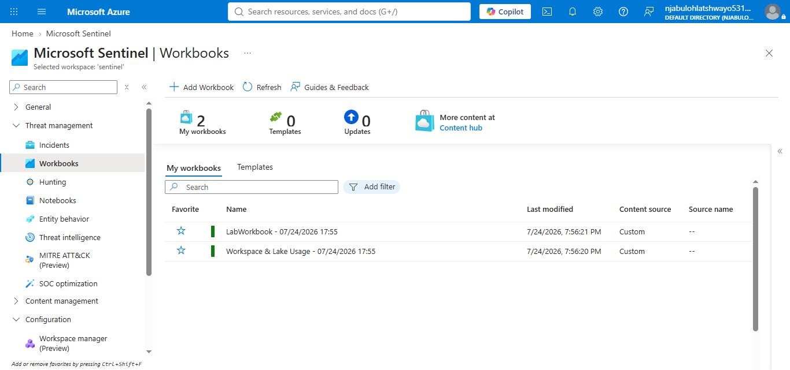
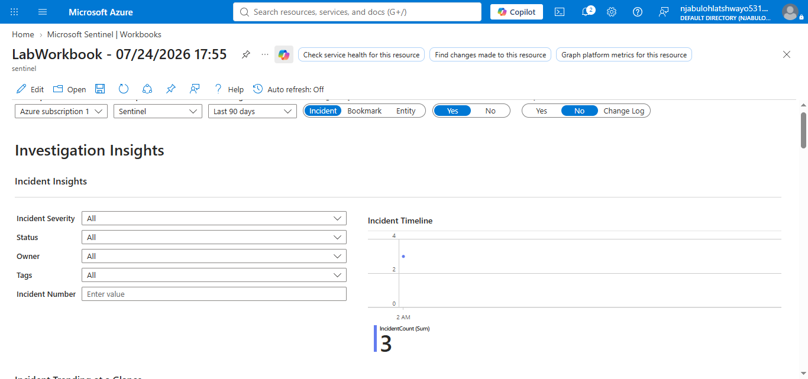
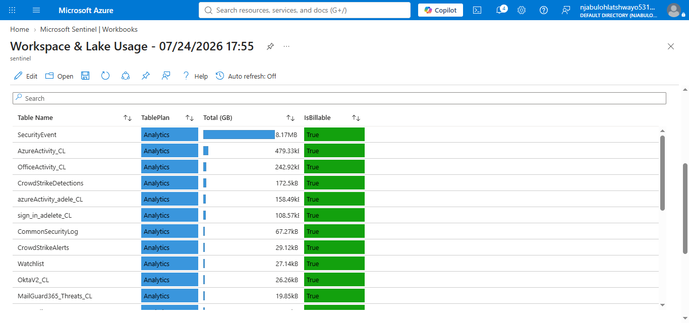
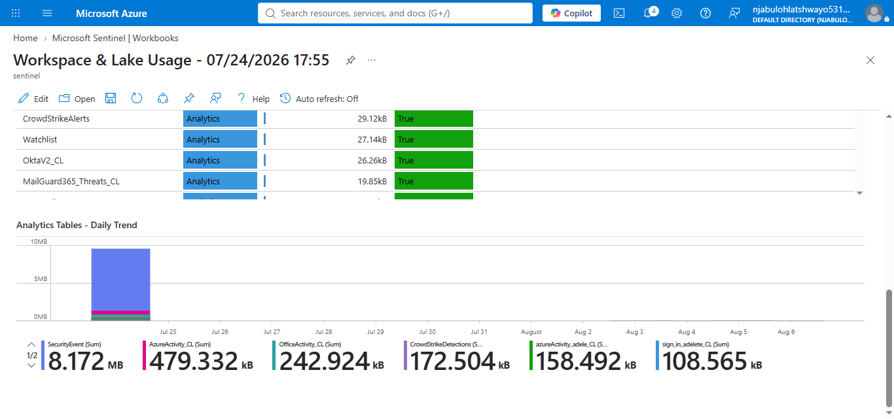

# Microsoft Sentinel Workbooks

## Overview

Microsoft Sentinel Workbooks provide interactive dashboards that enable Security Operations Center (SOC) analysts to visualize security data collected within Microsoft Sentinel. Workbooks combine charts, tables, metrics, and visualizations to support security monitoring, incident investigations, and operational reporting.

This guide documents the implementation and validation of Microsoft Sentinel Workbooks within the Microsoft Sentinel lab environment.

---

## Objectives

* Review available Microsoft Sentinel workbooks.
* Explore workbook dashboards.
* Validate workbook functionality.
* Review workspace monitoring information.
* Document the workbook implementation.

---

## Workbooks Reviewed

During this implementation, the following Microsoft Sentinel workbooks were available:

* **LabWorkbook**
* **Workspace & Lake Usage**

---

## Folder Structure

```text
workbooks/
├── configuration/
├── customization/
├── validation/
├── notes/
├── screenshots/
└── README.md
```

---

## Screenshots

### 1. Workbooks Overview



The Microsoft Sentinel **My Workbooks** page displaying the workbooks available in the lab environment.

---

### 2. LabWorkbook Dashboard



The **LabWorkbook** after configuring the required parameters (**Incident Severity** and **Status**) and successfully loading the workbook dashboard.

---

### 3. Workspace & Lake Usage Dashboard



The **Workspace & Lake Usage** workbook showing Microsoft Sentinel workspace monitoring information and Log Analytics usage.

---

### 4. Workspace Summary



The workspace summary section displaying monitoring information and operational metrics for the Microsoft Sentinel environment.

---

## Implementation Summary

During this implementation, the Microsoft Sentinel Workbooks feature was successfully explored and validated.

The **LabWorkbook** initially required parameter configuration before queries could execute. After configuring the **Incident Severity** and **Status** parameters, the workbook loaded successfully and displayed the expected dashboard.

The **Workspace & Lake Usage** workbook loaded successfully and provided visibility into workspace activity and usage statistics.

---

## Skills Demonstrated

* Microsoft Sentinel Workbooks
* Dashboard Configuration
* Workbook Parameter Configuration
* Security Monitoring
* Microsoft Sentinel Visualization
* Log Analytics Workspace Monitoring
* SOC Dashboard Validation

---

## Key Findings

* Microsoft Sentinel Workbooks provide interactive dashboards for SOC monitoring.
* Workbook parameters must be correctly configured before some queries can execute.
* The LabWorkbook required initialization of the **Incident Severity** and **Status** parameters.
* The Workspace & Lake Usage workbook successfully displayed operational monitoring information.

---

## Conclusion

Microsoft Sentinel Workbooks provide an effective method for visualizing security operations and monitoring workspace activity. This implementation successfully validated both available workbooks, demonstrated workbook parameter configuration, and confirmed the ability to use workbooks for operational monitoring within Microsoft Sentinel.
