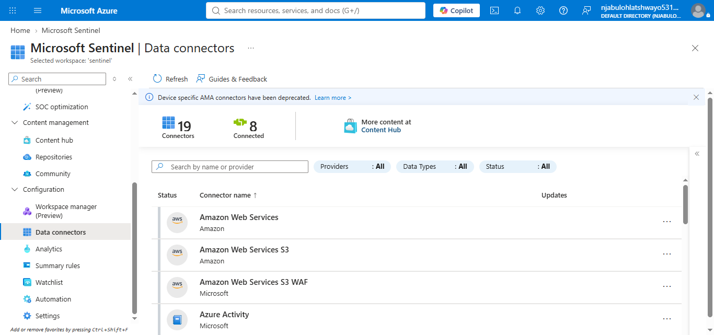
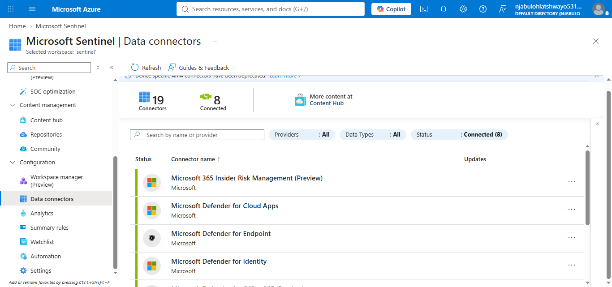
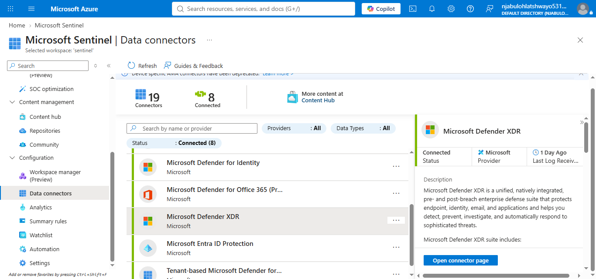
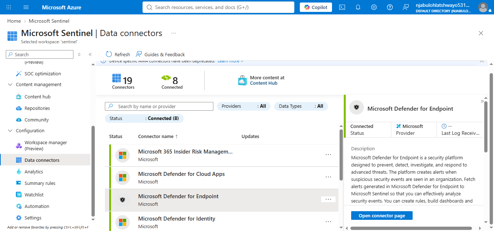
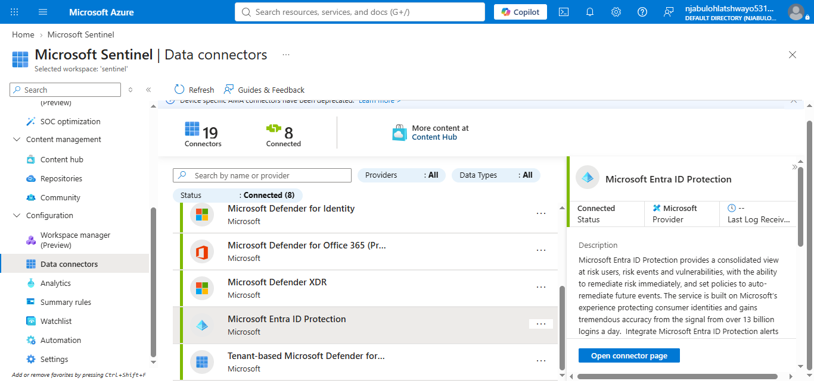

# Microsoft Sentinel Data Connectors

## Overview

Microsoft Sentinel Data Connectors provide the mechanism for collecting security telemetry from Microsoft services, third-party platforms, cloud providers, and on-premises environments. They enable Microsoft Sentinel to ingest security events that support threat detection, incident investigation, hunting, automation, and reporting.

This guide documents the implementation and validation of Microsoft Sentinel Data Connectors within the Microsoft Sentinel lab environment.

---

## Objectives

* Review available Microsoft Sentinel data connectors.
* Identify connected data sources.
* Validate connector availability.
* Review connector configuration.
* Document the connected security data sources.

---

## Connected Data Connectors

During this implementation, the following Microsoft data connectors were available:

* Microsoft 365 Insider Risk Management (Preview)
* Microsoft Defender for Cloud Apps
* Microsoft Defender for Endpoint
* Microsoft Defender for Identity
* Microsoft Defender for Office 365 (Preview)
* Microsoft Defender XDR
* Microsoft Entra ID Protection
* Microsoft Defender for Cloud (Tenant-based)

These connectors provide security telemetry from Microsoft's security ecosystem and enrich Microsoft Sentinel with endpoint, identity, cloud, email, and application security events.

---

## Folder Structure

```text id="rjck4x"
data-connectors/
├── configuration/
├── inventory/
├── validation/
├── notes/
├── screenshots/
└── README.md
```

---

## Screenshots

### 1. Data Connectors Overview



Displays the Microsoft Sentinel **Data Connectors** page.

---

### 2. Connected Data Connectors



Shows the connected Microsoft data connectors available within the lab environment.

---

### 3. Microsoft Defender XDR Connector



Displays the configuration page for the Microsoft Defender XDR connector.

---

### 4. Microsoft Defender for Endpoint Connector



Shows the Microsoft Defender for Endpoint connector configuration.

---

### 5. Microsoft Entra ID Protection Connector



Displays the Microsoft Entra ID Protection connector configuration.

---

## Validation Summary

The Microsoft Sentinel Data Connectors section was successfully reviewed. Multiple Microsoft security products were connected to the Sentinel workspace, demonstrating the integration of endpoint, identity, cloud, email, and application security telemetry into a centralized SIEM platform.

---

## Skills Demonstrated

* Microsoft Sentinel Data Connectors
* Security Telemetry Integration
* Microsoft Security Integration
* Connector Validation
* Security Data Collection
* SIEM Data Ingestion
* SOC Platform Administration

---

## Conclusion

Microsoft Sentinel Data Connectors form the foundation of the SIEM by collecting telemetry from connected security platforms. The implementation successfully validated the available Microsoft connectors and confirmed their availability for use in monitoring, detection, investigation, and response activities.
