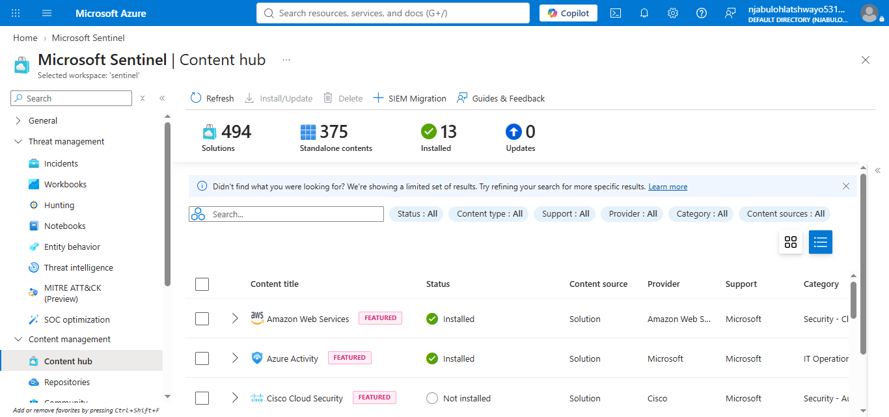
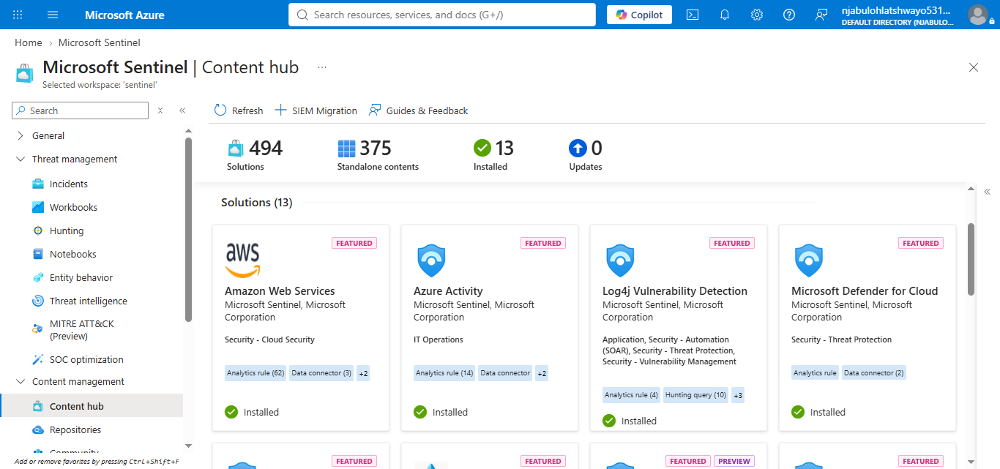
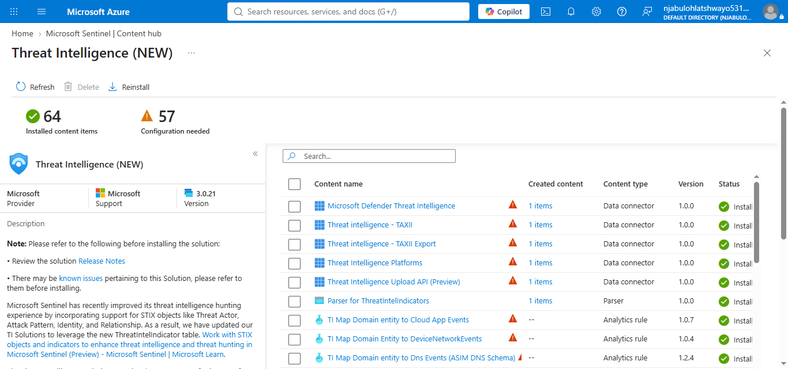
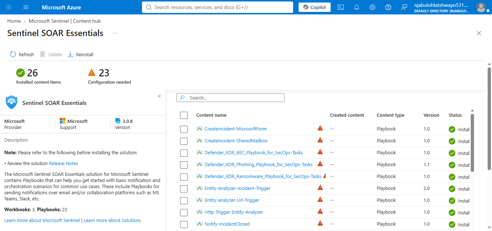

# Microsoft Sentinel Content Hub

## Overview

Microsoft Sentinel Content Hub provides centralized access to Microsoft and community-developed solutions that extend Microsoft Sentinel with analytics rules, hunting queries, workbooks, automation, playbooks, parsers, watchlists, and other security content. It simplifies the deployment and management of security capabilities within the Microsoft Sentinel environment.

This guide documents the review and validation of the Microsoft Sentinel Content Hub within the Microsoft Sentinel lab environment.

---

## Objectives

* Review Microsoft Sentinel Content Hub.
* Identify installed security solutions.
* Validate solution availability.
* Review Microsoft and community content.
* Document installed solutions.

---

## Installed Solutions

The following solutions were installed during this implementation:

* Amazon Web Services
* Azure Activity
* Log4j Vulnerability Detection
* Microsoft Defender for Cloud
* Microsoft Defender XDR
* Microsoft Entra ID
* Network (Preview)
* Security Threat Essentials
* Sentinel SOAR Essentials
* SOC Handbook
* Threat Intelligence (NEW)
* UEBA Essentials

These solutions provide security content that enhances Microsoft Sentinel with analytics, investigations, threat intelligence, automation, and operational guidance.

---

## Folder Structure

```text id="tq7wkt"
content-hub/
├── configuration/
├── solutions/
├── validation/
├── notes/
├── screenshots/
└── README.md
```

---

## Screenshots

### 1. Content Hub Overview



Displays the Microsoft Sentinel Content Hub home page.

---

### 2. Installed Solutions



Shows the installed Microsoft and community solutions available within the Microsoft Sentinel environment.

---

### 3. Microsoft Defender XDR Solution


Displays the Microsoft Defender XDR solution details.

---

### 4. Threat Intelligence (NEW)



Shows the Threat Intelligence solution available through Microsoft Content Hub.

---

### 5. Sentinel SOAR Essentials



Displays the Sentinel SOAR Essentials solution used to support automation and orchestration.

---

## Validation Summary

The Microsoft Sentinel Content Hub was successfully reviewed. Multiple Microsoft and community solutions were installed within the workspace, demonstrating how Content Hub provides reusable security content that extends Microsoft Sentinel functionality.

---

## Skills Demonstrated

* Microsoft Sentinel Content Hub
* Solution Management
* Microsoft Security Integrations
* Content Deployment
* SOC Platform Administration
* Security Content Validation
* Security Operations Enablement

---

## Conclusion

Microsoft Sentinel Content Hub provides an efficient method for deploying and managing security solutions. The installed solutions reviewed during this implementation demonstrate how Microsoft Sentinel can be extended with analytics, threat intelligence, automation, workbooks, investigations, and operational guidance using Microsoft and community-developed content.

