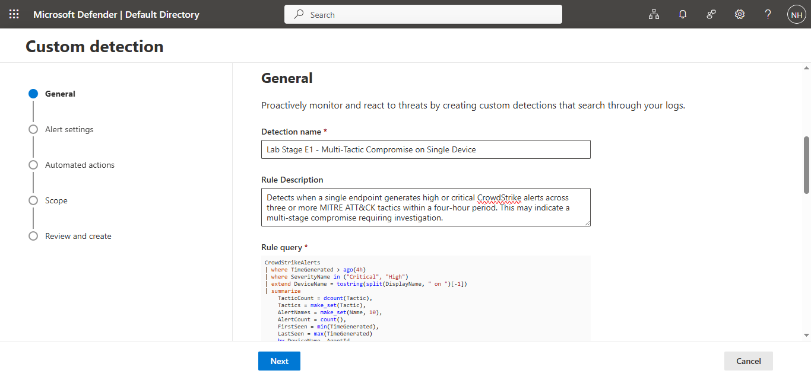
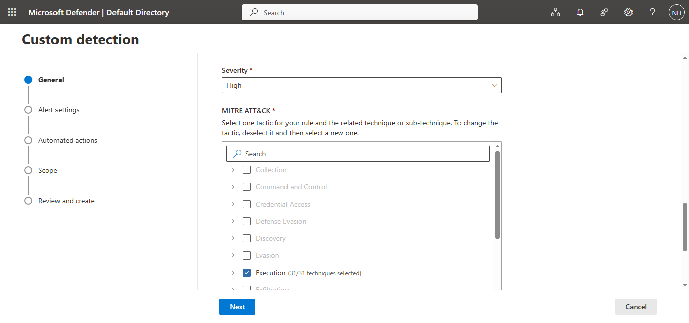
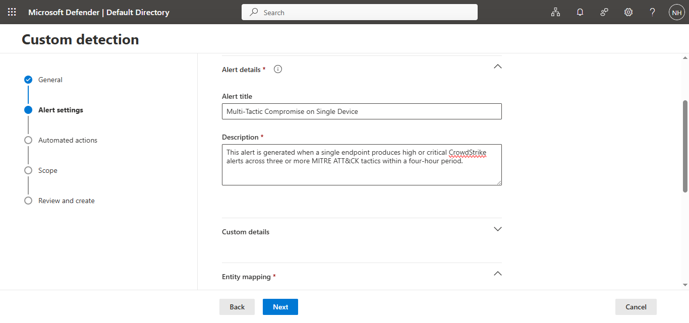
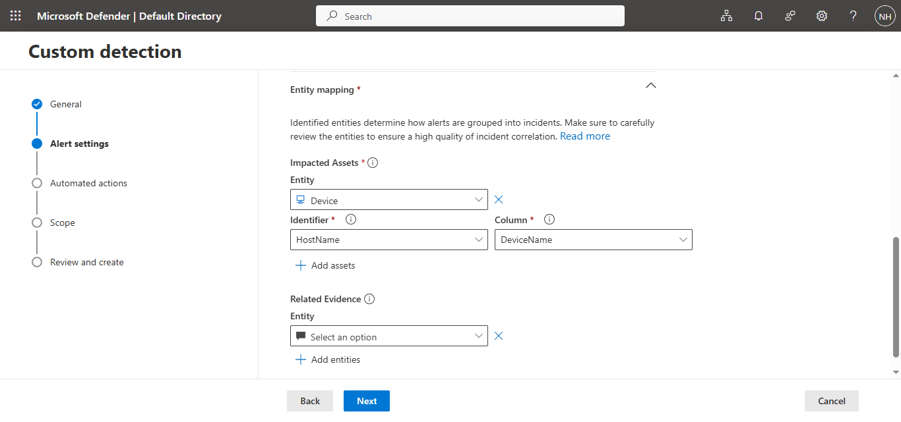
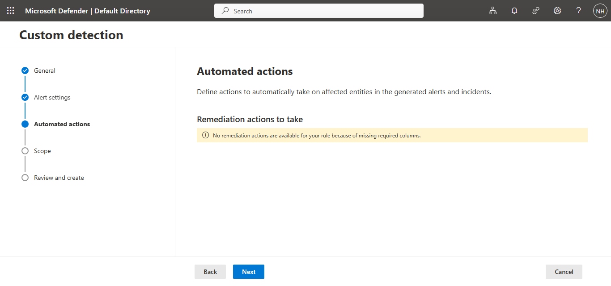
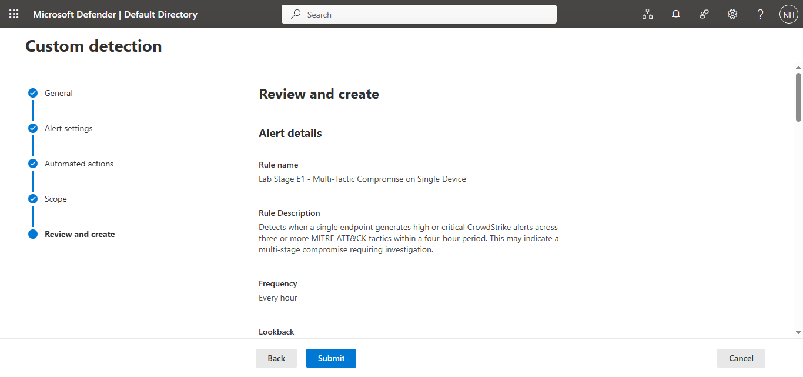
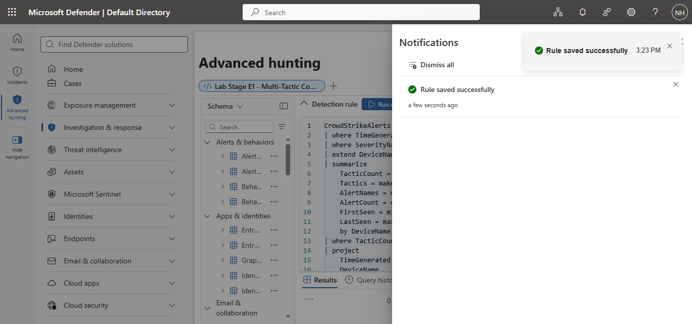
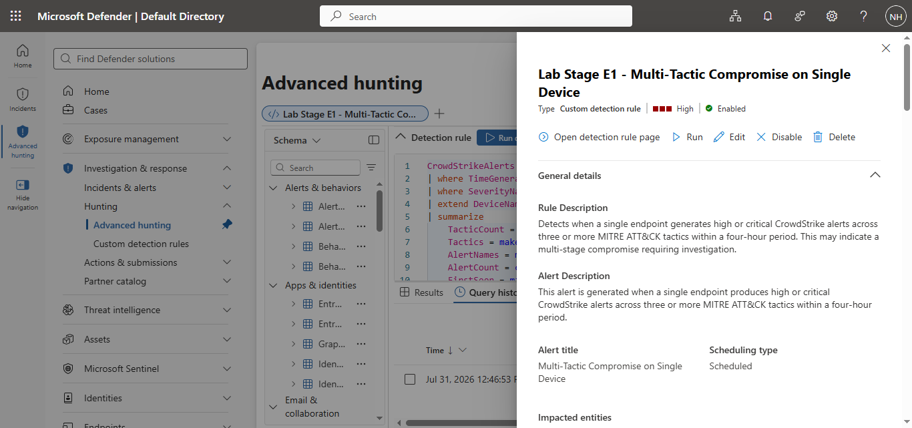

# Microsoft Sentinel Project 01 – Exploration and First Detection Rule

## Project Overview

This project documents my completion of **Exercise 1 – Exploration: Hunting Across Your Data** from the Microsoft Sentinel Training Lab.

The objective was to learn how to:

- Explore security data using Kusto Query Language (KQL)
- Investigate endpoint, firewall, identity, and cloud telemetry
- Correlate events across multiple data sources
- Build and validate a custom Microsoft Defender detection rule

---

# Skills Demonstrated

- Microsoft Sentinel
- Microsoft Defender XDR
- Kusto Query Language (KQL)
- Threat Hunting
- Detection Engineering
- MITRE ATT&CK Framework
- CrowdStrike Investigation
- Palo Alto Firewall Analysis
- Okta Identity Monitoring
- AWS CloudTrail Investigation
- Cross-source Event Correlation
- Custom Detection Rules

---

# Project Structure

```
01-exploration-and-first-detection/

├── queries/
├── screenshots/
├── notes/
└── README.md
```

---

# Step 1 – Discover Available Tables

## Query

[01-discover-tables.kql](queries/01-discover-tables.kql)

## Evidence


## Findings

Executed a KQL search across all available tables to identify ingested data sources within the Microsoft Sentinel workspace. This established the available telemetry before beginning the investigation.

---

# Step 2 – Explore CrowdStrike Endpoint Alerts

## Query

[02-crowdstrike-alert-summary.kql](queries/02-crowdstrike-alert-summary.kql)

## Evidence


## Findings

Reviewed CrowdStrike endpoint alerts and summarized activity by severity and MITRE ATT&CK tactic. This helped identify high-risk endpoint activity across multiple stages of an attack.

---

# Step 3 – Explore Palo Alto Firewall Traffic

## Query

[03-palo-alto-traffic-overview.kql](queries/03-palo-alto-traffic-overview.kql)

## Evidence


## Findings

Analyzed Palo Alto firewall logs to understand overall traffic patterns, including event volume and unique source and destination activity.

---

# Step 4 – Investigate Blocked Firewall Traffic

## Query

[04-blocked-firewall-traffic.kql](queries/04-blocked-firewall-traffic.kql)

## Evidence


## Findings

Investigated blocked and denied firewall connections to identify potentially malicious hosts generating repeated connection attempts.

---

# Step 5 – Explore Okta Identity Events

## Query

[05-okta-identity-overview.kql](queries/05-okta-identity-overview.kql)

## Evidence


## Findings

Reviewed Okta authentication events and identity activity to understand user authentication behavior and identify potential identity-related security events.

---

# Step 6 – Explore AWS CloudTrail Activity

## Query

[06-aws-cloudtrail-overview.kql](queries/06-aws-cloudtrail-overview.kql)

## Evidence


## Findings

Examined AWS CloudTrail logs to review cloud API activity and understand administrative operations performed within the AWS environment.

---

# Step 7 – Cross-Source Investigation Timeline

## Query

[07-cross-source-timeline.kql](queries/07-cross-source-timeline.kql)

## Evidence

### Timeline Visualization


### Correlated Events


## Findings

Developed a cross-source KQL query that correlates endpoint, firewall, identity, and cloud telemetry into a unified investigation timeline.

During execution, the query primarily returned Okta identity events, including authentication and MFA-related activities, demonstrating how Microsoft Sentinel can consolidate events from multiple security platforms.

---

# Step 8 – Multi-Tactic Compromise Detection Query

## Query

[08-multi-tactic-compromise-detection.kql](queries/08-multi-tactic-compromise-detection.kql)

## Evidence


## Findings

Developed and validated a KQL detection query designed to identify endpoints experiencing high or critical CrowdStrike alerts across three or more MITRE ATT&CK tactics within a four-hour period.

The query executed successfully but returned no matching devices during the selected time window.

---

# Step 9 – Create and Verify the Detection Rule

## Query

[08-multi-tactic-compromise-detection.kql](queries/08-multi-tactic-compromise-detection.kql)

## Evidence

### Detection Rule Configuration





### Alert Configuration



### Entity Mapping



### Automated Response Configuration



### Review



### Detection Rule Created



### Detection Rule Verification



## Findings

Successfully created a scheduled Microsoft Defender custom detection rule based on the validated KQL query.

The detection rule:

- Executes every hour
- Reviews the previous four hours of endpoint activity
- Detects devices generating high or critical CrowdStrike alerts across three or more MITRE ATT&CK tactics
- Maps the impacted device using the DeviceName field for improved incident correlation

This demonstrates the complete detection engineering workflow, from hunting and query development to operational detection deployment.

---

# Exercise Summary

This project demonstrates the complete lifecycle of a Microsoft Sentinel investigation.

## Technologies Used

- Microsoft Sentinel
- Microsoft Defender XDR
- CrowdStrike
- Palo Alto Networks
- Okta
- AWS CloudTrail
- Kusto Query Language (KQL)

## Skills Demonstrated

- Threat Hunting
- Security Monitoring
- Log Analysis
- KQL Query Development
- Event Correlation
- Detection Engineering
- Custom Detection Rule Creation
- Entity Mapping
- Microsoft Sentinel Investigation

---

# Repository Contents

| Folder | Description |
|---------|-------------|
| queries | All KQL queries developed during the exercise |
| screenshots | Evidence collected during each investigation step |
| notes | Detailed notes and explanations for every step |
| README.md | Project documentation |

---

# Conclusion

This project demonstrates practical experience using Microsoft Sentinel and Microsoft Defender XDR to investigate security telemetry, correlate events across multiple data sources, and develop custom detections using Kusto Query Language (KQL). It reflects the investigative and detection engineering workflow commonly performed by Security Operations Center (SOC) analysts.


