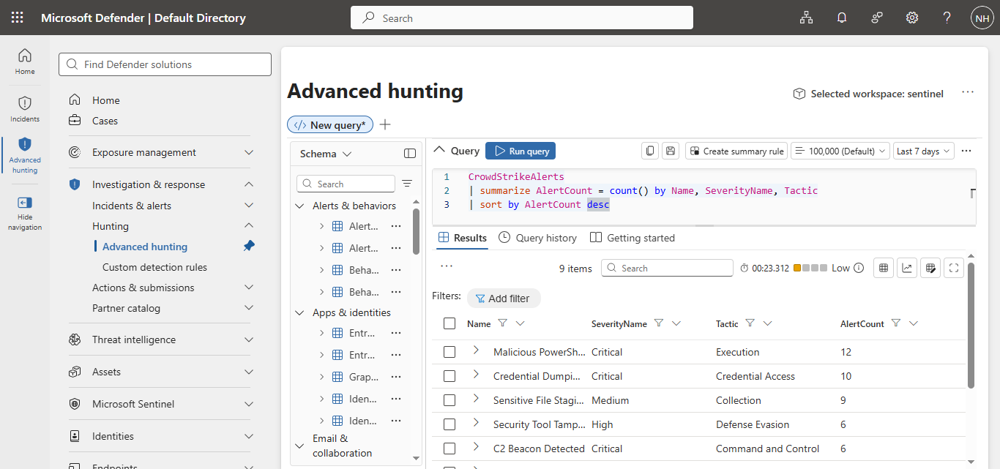
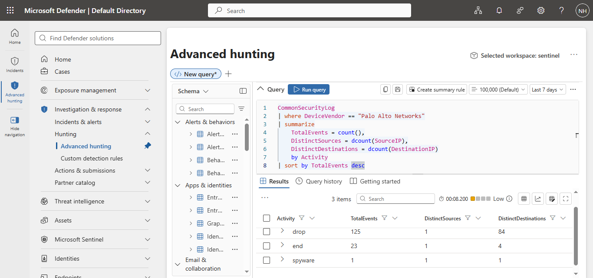
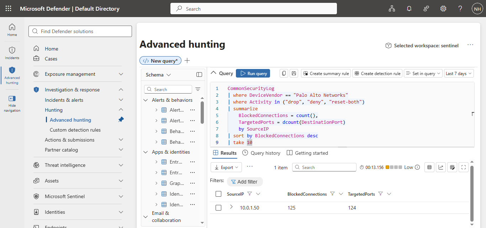
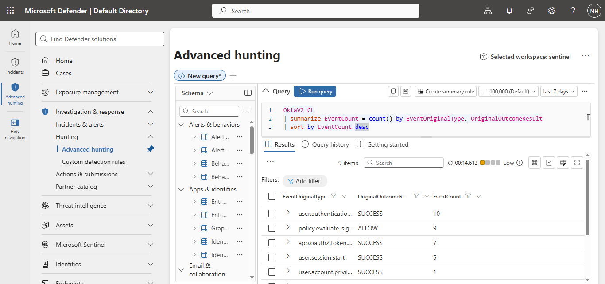
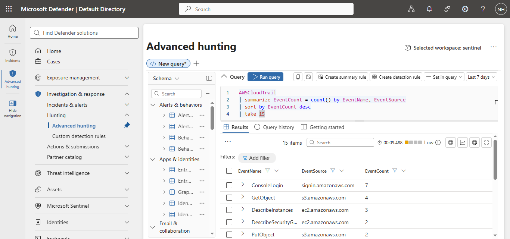
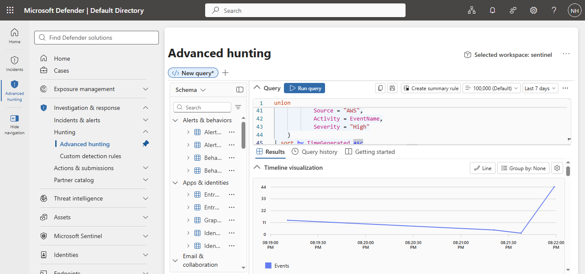
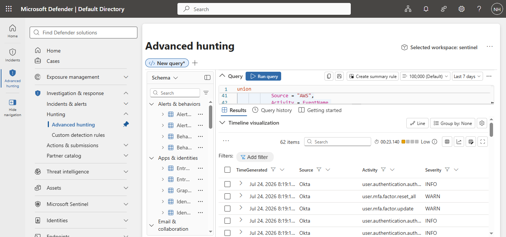
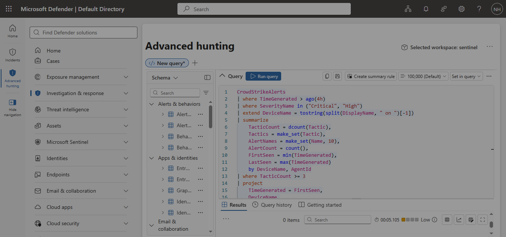

# Project 01 – Exploration: Hunting Across Your Data

> **Status:** 🚧 In Progress

## Project Overview

In this project, I explored the Microsoft Sentinel Training Lab to understand the available security telemetry and practice threat hunting using Kusto Query Language (KQL).

The objective was to:

- Discover available data sources.
- Analyze endpoint, network, identity, and cloud telemetry.
- Build a custom detection rule based on suspicious activity.

---

# Investigation Progress

## ✅ Step 1 – Discover Available Tables

### Objective

Identify the available data tables in the Microsoft Sentinel environment.

### Query

[01-discover-tables.kql](queries/01-discover-tables.kql)

### Evidence

### Findings

The environment contained multiple security data sources, including Windows security events, Microsoft Graph audit logs, Microsoft Entra ID sign-in data, and identity information. This confirmed that the lab provides telemetry from several security domains for investigation.

---

## ✅ Step 2 – CrowdStrike Endpoint Alerts

### Query

[02-crowdstrike-alert-summary.kql](queries/02-crowdstrike-alert-summary.kql)

### Evidence

### Findings

Critical endpoint alerts included:

- Malicious PowerShell
- Credential Dumping
- C2 Beacon Detection

The alerts mapped to multiple MITRE ATT&CK tactics, including:

- Execution
- Credential Access
- Defense Evasion
- Collection
- Command and Control

The diversity of tactics suggests a multi-stage attack requiring further investigation.

---

## ✅ Step 3 – Palo Alto Traffic Overview

### Query

[03-palo-alto-traffic-overview.kql](queries/03-palo-alto-traffic-overview.kql)

### Evidence

### Findings

The firewall recorded:

- 125 dropped connections
- 23 completed sessions
- 1 spyware-related event

Most firewall activity consisted of dropped connections, indicating that the firewall was actively blocking suspicious network traffic.

---

## ✅ Step 4 – Investigate Blocked Firewall Traffic

### Query

[04-blocked-firewall-traffic.kql](queries/04-blocked-firewall-traffic.kql)

### Evidence

### Findings

The investigation identified source IP **10.0.1.50** as responsible for:

- **125 blocked connections**
- **124 unique destination ports**

The high number of targeted ports is consistent with reconnaissance or port-scanning behavior and warrants further investigation.

---

## ✅ Step 5 – Okta Identity Overview

### Query

[05-okta-identity-overview.kql](queries/05-okta-identity-overview.kql)

### Evidence

### Findings

The identity logs showed normal authentication activity, including successful user authentication, OAuth token generation, session creation, and policy evaluations. No widespread authentication failures or suspicious login patterns were identified during this stage of the investigation.
---

## ✅ Step 6 – AWS CloudTrail Overview

### Query

[06-aws-cloudtrail-overview.kql](queries/06-aws-cloudtrail-overview.kql)

### Evidence

### Findings

The CloudTrail logs showed normal cloud activity, including AWS console logins, S3 object access, EC2 instance inspection, and security group queries. No evidence of suspicious administrative actions, such as creating users or disabling logging, was observed during this stage of the investigation.

---

## ✅ Step 7 – Cross-Source Investigation Timeline

### Query

[07-cross-source-timeline.kql](queries/07-cross-source-timeline.kql)

### Evidence

#### Timeline Visualization

#### Correlated Events

### Findings

A cross-source KQL query was used to correlate events from CrowdStrike, Palo Alto, Okta, and AWS CloudTrail into a unified timeline.

For the selected time range, the returned events consisted primarily of Okta identity activity, including user authentication events and MFA-related operations. No matching high-severity endpoint or cloud administrative events were returned by the query during this execution.

This exercise demonstrates how Microsoft Sentinel can combine telemetry from multiple security platforms into a single investigation timeline.

---

## ✅ Step 8 – Multi-Tactic Compromise Detection

### Query

[08-multi-tactic-compromise-detection.kql](queries/08-multi-tactic-compromise-detection.kql)

### Evidence

### Findings

A custom KQL detection query was developed to identify endpoints experiencing high or critical CrowdStrike alerts across three or more MITRE ATT&CK tactics within a four-hour period.

The query executed successfully but returned no matching devices during the selected time window. This indicates that no endpoints met the defined detection threshold at the time of execution.
# Skills Demonstrated

- Microsoft Sentinel
- Microsoft Defender XDR
- Kusto Query Language (KQL)
- Threat Hunting
- Detection Engineering
- Network Traffic Analysis
- Endpoint Security Analysis
- MITRE ATT&CK Framework

