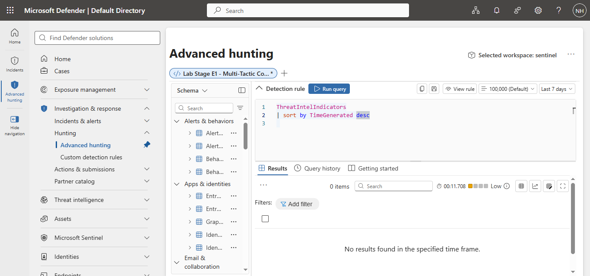
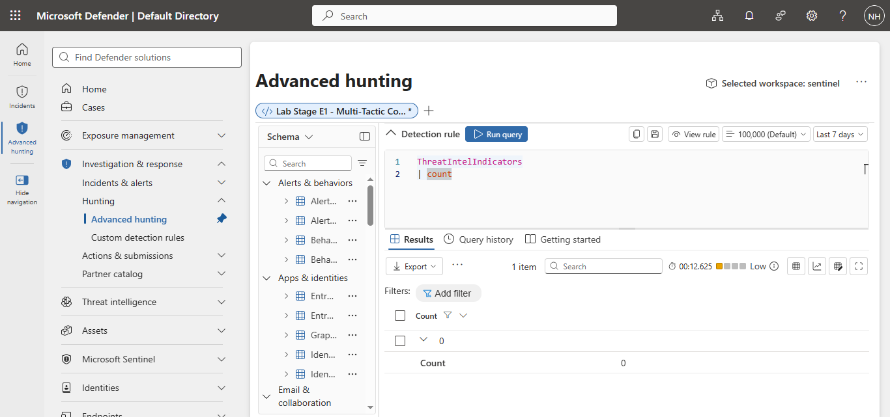
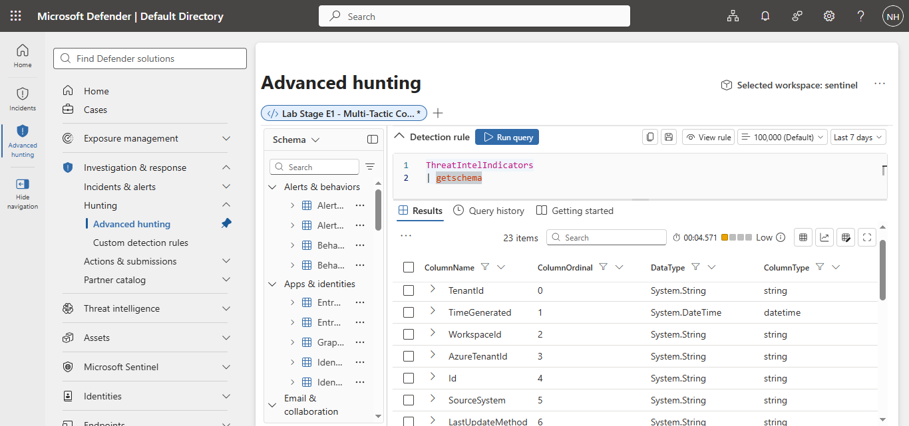
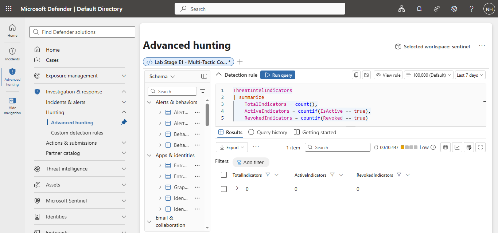
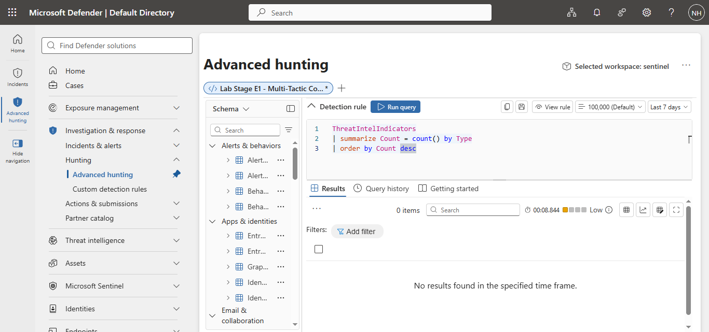

# Microsoft Sentinel Project 02 – Investigation and Incident Analysis

## Project Overview

This project documents the completion of **Exercise 2** from the Microsoft Sentinel Training Lab.

The purpose of this exercise is to investigate security incidents, correlate evidence from multiple data sources, and document the investigation process using Microsoft Sentinel and Microsoft Defender.

---

# Step 1 – View Threat Intelligence Indicators

## Query

[01-view-threat-intelligence-indicators.kql](queries/01-view-threat-intelligence-indicators.kql)

## Evidence



## Findings

A KQL query was executed against the **ThreatIntelIndicators** table to verify the availability of Threat Intelligence Indicators (IOCs).

The query completed successfully but returned no records, indicating that no threat intelligence indicators were currently present in the lab environment. This step confirmed that the table is available and ready for future threat intelligence investigations.

---

# Step 2 – Threat Intelligence Summary

## Query

[02-threat-intelligence-summary.kql](queries/02-threat-intelligence-summary.kql)

## Evidence



---

# Step 3 – Explore the Threat Intelligence Schema

## Query

[03-threat-intelligence-schema.kql](queries/03-threat-intelligence-schema.kql)

## Evidence



## Findings

The `getschema` operator was used to inspect the structure of the **ThreatIntelIndicators** table.

The query identified 23 available columns, including:

- TimeGenerated
- Id
- IsActive
- Revoked
- ValidFrom
- ValidUntil
- Confidence
- Pattern
- ObservableKey
- ObservableValue
- Type

This step confirmed that the Microsoft Defender Threat Intelligence schema in this lab differs slightly from the original Microsoft training documentation. Identifying the available fields ensures future KQL queries use the correct column names for this environment.

## Findings

A KQL count query was executed against the **ThreatIntelIndicators** table to determine whether any threat intelligence indicators were present.

The query completed successfully and returned a count of **0**, confirming that no indicators were available in the lab environment during this investigation. This verified that the table is accessible and ready for future threat intelligence data.

---

# Step 4 – Threat Intelligence Status

## Query

[04-threat-intelligence-status.kql](queries/04-threat-intelligence-status.kql)

## Evidence



---

# Step 5 – Review Threat Intelligence Indicator Types

## Query

[05-threat-intelligence-indicator-types.kql](queries/05-threat-intelligence-indicator-types.kql)

## Evidence



## Findings

A KQL query was executed to summarize Threat Intelligence Indicators by their **Type**.

The query completed successfully but returned no results because the lab environment currently contains no Threat Intelligence Indicators. This step demonstrates how indicators can be categorized by type when threat intelligence data is available.

## Findings

A KQL summary query was executed against the **ThreatIntelIndicators** table to review the current status of threat intelligence indicators.

The query returned **0 total indicators**, **0 active indicators**, and **0 revoked indicators**, confirming that the table is available and functioning correctly but currently contains no threat intelligence data in the lab environment.

## Skills Demonstrated

- Microsoft Sentinel
- Microsoft Defender XDR
- Threat Investigation
- Incident Analysis
- Kusto Query Language (KQL)
- Event Correlation
- MITRE ATT&CK
- Security Operations (SOC)

---

## Project Structure

```
02-investigation-and-incident-analysis/

├── queries/
├── screenshots/
├── notes/
└── README.md
```
