# Microsoft Sentinel Project 03 – Enterprise SOC Investigation

## Project Overview

This project demonstrates a realistic Security Operations Center (SOC) investigation using Microsoft Sentinel and Microsoft Defender XDR.

The investigation validates enterprise security data sources and correlates endpoint, identity, firewall, and operating system telemetry to identify suspicious activity using Kusto Query Language (KQL).

---

## Objectives

- Validate connected security data sources.
- Investigate endpoint security alerts.
- Analyze firewall activity.
- Review identity authentication events.
- Correlate events across multiple security products.
- Document findings using KQL, screenshots, and investigation notes.

---

## Skills Demonstrated

- Microsoft Sentinel
- Microsoft Defender XDR
- Kusto Query Language (KQL)
- Threat Hunting
- SOC Investigation
- Event Correlation
- Detection Engineering
- Microsoft Entra ID
- CrowdStrike Falcon
- Palo Alto Firewall
- Okta Identity
- Windows Security Monitoring

---

## Data Sources

- CrowdStrike Alerts
- Microsoft Entra ID
- Okta
- Palo Alto Firewall (CommonSecurityLog)
- Windows Security Events

---

## Project Structure

```text
03-enterprise-soc-investigation/

├── README.md
├── queries/
├── screenshots/
└── notes/
```

---

# Step 1 – Validate Connected Data Sources

## Query

[01-validate-data-sources.kql](queries/01-validate-data-sources.kql)

## Evidence

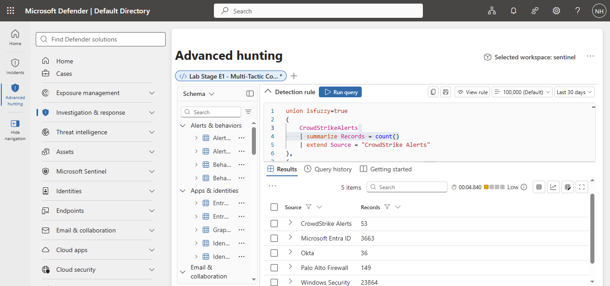

## Findings

A KQL query was executed to validate that Microsoft Sentinel was receiving telemetry from multiple enterprise security platforms.

The investigation confirmed active telemetry from:

- CrowdStrike Alerts (53 records)
- Microsoft Entra ID (3,663 records)
- Okta (36 records)
- Palo Alto Firewall (149 records)
- Windows Security Events (23,864 records)

This confirmed that the environment contains sufficient endpoint, identity, firewall, and operating system telemetry to perform enterprise-scale SOC investigations.

---
---

# Step 2 – CrowdStrike Endpoint Investigation

## Query

[02-crowdstrike-endpoint-investigation.kql](queries/02-crowdstrike-endpoint-investigation.kql)

## Evidence

### Endpoint Alert Overview

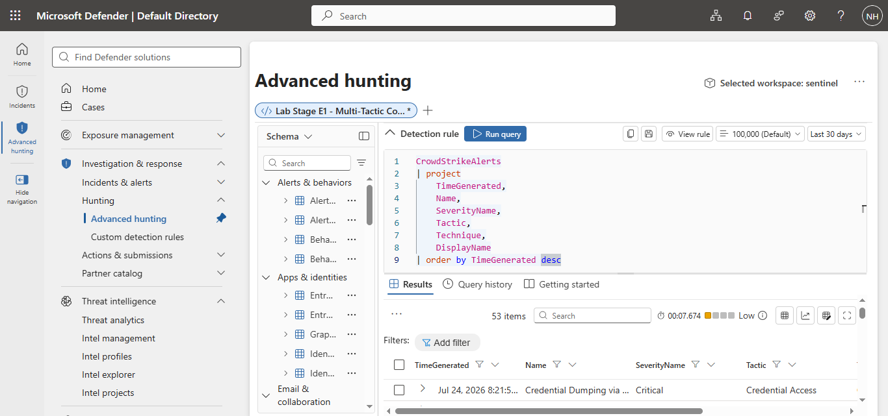

### Critical Endpoint Alerts

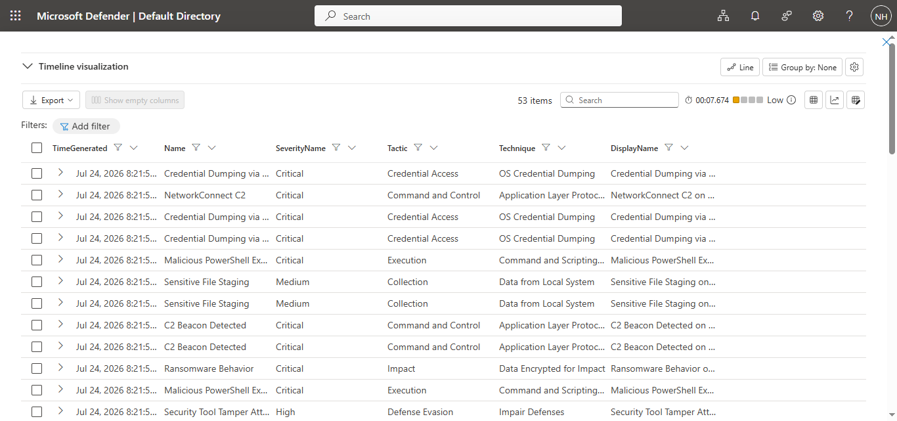

## Findings

A KQL investigation was performed against the **CrowdStrikeAlerts** table to review endpoint detections.

The query returned **53 alerts**, including several critical detections such as Credential Dumping, Command and Control activity, Malicious PowerShell Execution, Security Tool Tampering, Sensitive File Staging, and Ransomware Behavior.

These alerts mapped to multiple MITRE ATT&CK tactics, demonstrating how Microsoft Sentinel can be used to investigate endpoint activity and understand the progression of an attack across different stages of the cyber kill chain.

---

# Step 3 – Palo Alto Firewall Investigation

## Query

[03-palo-alto-firewall-investigation.kql](queries/03-palo-alto-firewall-investigation.kql)

## Evidence

### Firewall Activity Overview

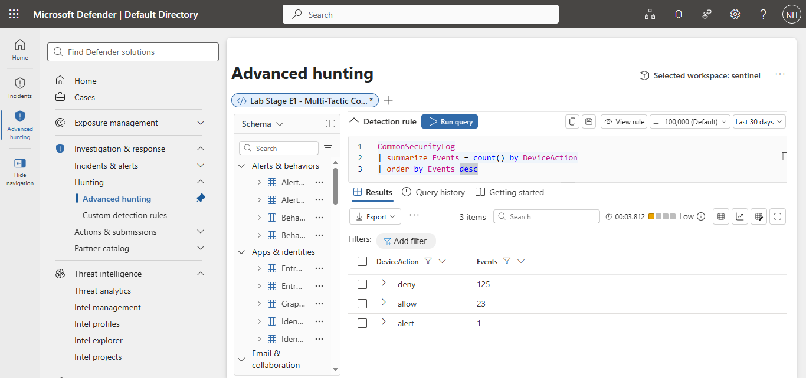

## Findings

A KQL query summarized Palo Alto firewall activity by device action.

The investigation identified **125 denied connections**, **23 allowed connections**, and **1 firewall alert**. These results demonstrate how Microsoft Sentinel can be used to analyze firewall policy enforcement and identify network activity that may require additional investigation.

---

---

# Step 4 – Microsoft Entra ID Application Sign-in Overview

## Objective

Analyze Microsoft Entra ID authentication logs to identify the cloud applications users access most frequently and establish a baseline of normal sign-in activity.

## Query

[04-identity-application-overview.kql](queries/04-identity-application-overview.kql)

## Query

```kql
EntraIdSignInEvents
| summarize SignInCount = count() by Application
| order by SignInCount desc
```

## Evidence

### Query Execution

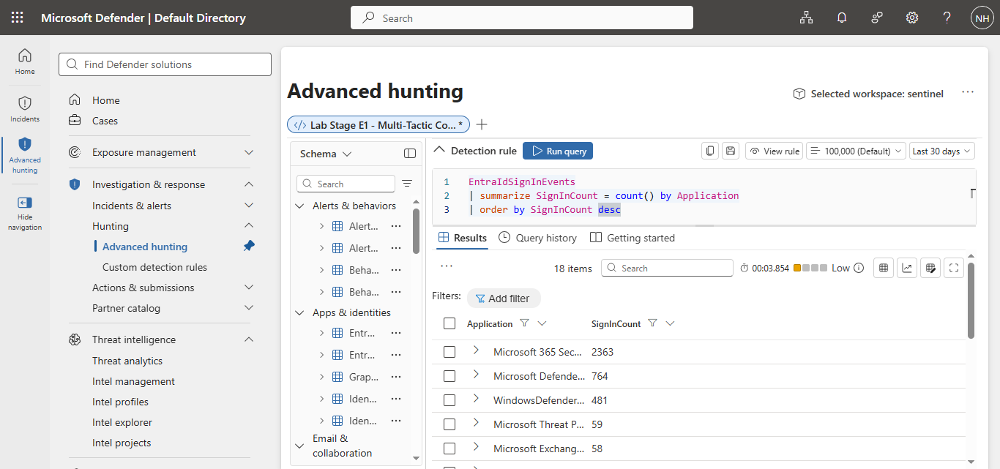

### Query Results

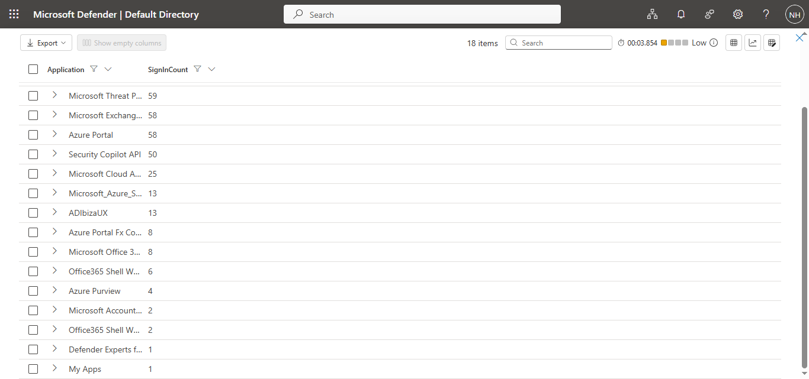

## Findings

A KQL query was executed against the **EntraIdSignInEvents** table to summarize authentication activity by application.

The investigation analyzed **3,903 sign-in events** and identified the following as the most frequently accessed applications:

| Application | Sign-ins |
|------------|---------:|
| Microsoft 365 Security | 2363 |
| Microsoft Defender | 764 |
| Windows Defender | 481 |
| Microsoft Threat Protection | 59 |
| Microsoft Exchange | 58 |
| Azure Portal | 58 |
| Security Copilot API | 50 |
| Microsoft Cloud App Security | 25 |
| Microsoft Azure Storage | 13 |
| ADIbizaUX | 13 |

The results establish a baseline of normal authentication activity across the Microsoft cloud environment.

Applications such as **Microsoft 365 Security**, **Microsoft Defender**, and **Windows Defender** generated the highest number of authentication events, indicating regular usage by security personnel and integrated Microsoft services.

Administrative services such as **Azure Portal** and **Microsoft Exchange** are particularly important because they provide access to cloud administration and email services. Monitoring authentication activity for these applications helps SOC analysts identify suspicious access patterns, compromised accounts, or unauthorized administrative activity.

This investigation demonstrates how Microsoft Sentinel can summarize thousands of authentication events into meaningful insights that help analysts understand user behavior and quickly identify areas requiring further investigation.

## Key Learning

This investigation introduced the use of the **summarize** operator to aggregate authentication logs by application.

Rather than reviewing thousands of individual sign-in events, SOC analysts first establish a baseline of normal application usage. This makes it easier to identify unusual authentication patterns, unexpected application access, and potential indicators of account compromise.

---

# Step 5 – Risky Sign-ins Investigation

## Objective

Review Microsoft Entra ID authentication logs to determine whether any sign-ins were classified as risky.

## Query

[05-risky-signins.kql](queries/05-risky-signins.kql)

## Evidence

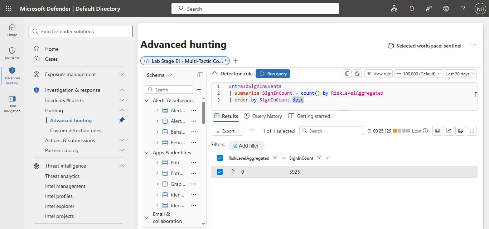

## Findings

A KQL query summarized authentication events by **RiskLevelAggregated**.

The investigation analyzed **3,925 sign-in events**, and all events were classified with a risk level of **0 (No Risk)**.

This indicates that Microsoft Entra ID did not identify any risky authentication activity during the selected time period.

Although no suspicious sign-ins were detected, this investigation demonstrates how Microsoft Sentinel can be used to continuously monitor identity risk and establish a baseline of normal authentication activity.

---

# Step 6 – Geographic Sign-in Investigation

## Objective

Analyze Microsoft Entra ID authentication logs to identify the countries from which users are signing in and establish a geographic baseline of normal authentication activity.

## Query

[06-signins-by-country.kql](queries/06-signins-by-country.kql)

## Evidence

### Query Execution

## Evidence


## Findings

A KQL query summarized Microsoft Entra ID authentication events by country.

The investigation analyzed **3,953 sign-in events**, and all authentication activity originated from **South Africa (ZA)**.

| Country | Sign-ins |
|---------|---------:|
| ZA (South Africa) | 3953 |

The results establish a geographic baseline of normal authentication activity. No sign-ins from foreign countries were identified during the selected period.

Establishing a geographic baseline enables SOC analysts to quickly detect unusual authentication locations, impossible travel scenarios, and potential account compromise in future investigations.

---

# Step 7 – Top User Accounts Investigation

## Objective

Identify the Microsoft Entra ID accounts generating the highest number of authentication events and establish a baseline of normal user activity.

## Query

[07-top-user-accounts.kql](queries/07-top-user-accounts.kql)

## Evidence

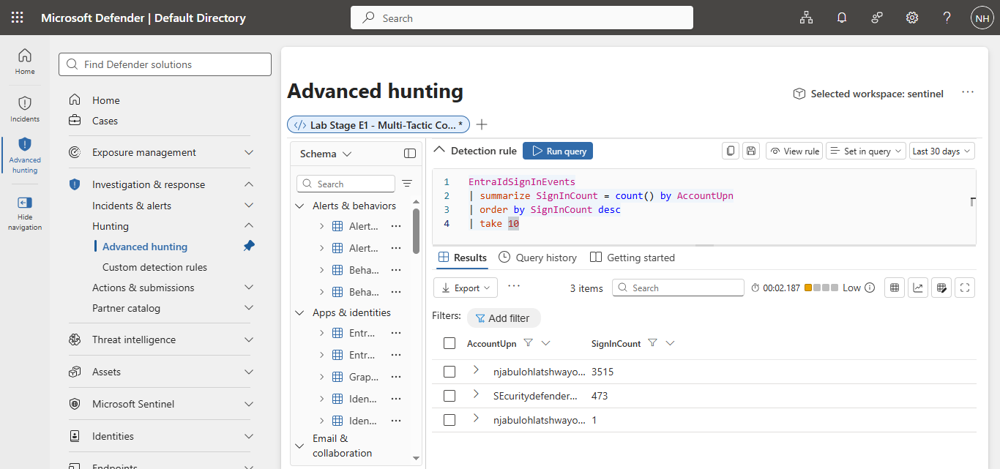

## Findings

A KQL query summarized Microsoft Entra ID authentication events by user account.

The investigation identified the primary user account as the most active with **3,515 sign-in events**, followed by a **Securitydefender** account with **473 sign-ins**.

The activity is consistent with the authentication baseline established in previous investigations, which showed no risky sign-ins and authentication originating from South Africa. The Securitydefender account appears to represent a service or security-related account generating expected automated authentication activity.

This investigation demonstrates how Microsoft Sentinel can be used to identify highly active accounts, establish normal authentication patterns, and prioritize accounts for further investigation when unusual activity is detected.

---

# Step 8 – Operating System Analysis

## Objective

Analyze Microsoft Entra ID authentication logs to determine which operating systems are used for user sign-ins and establish an operating system baseline.

## Query

[08-operating-system-analysis.kql](queries/08-operating-system-analysis.kql)

## Evidence

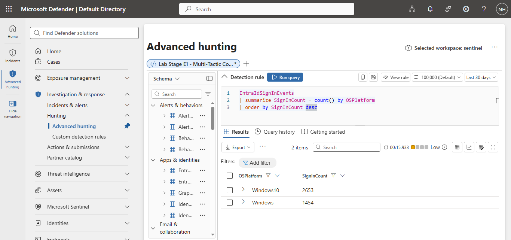

## Findings

A KQL query summarized authentication events by operating system.

The investigation identified the following authentication activity:

| Operating System | Sign-ins |
|-----------------|----------:|
| Windows 10 | 2653 |
| Windows | 1454 |

Windows 10 generated the majority of authentication events, followed by devices reported under the generic Windows platform.

No authentication activity from Linux, macOS, Android, or iOS devices was identified during the selected period.

This investigation establishes a baseline of operating systems within the environment and demonstrates how Microsoft Sentinel can be used to detect unexpected platforms during authentication investigations.

---

# Step 9 – Browser Analysis

## Objective

Analyze Microsoft Entra ID authentication logs to identify the browsers and client applications used during user authentication.

## Query

[09-browser-analysis.kql](queries/09-browser-analysis.kql)

## Evidence

### Query Execution

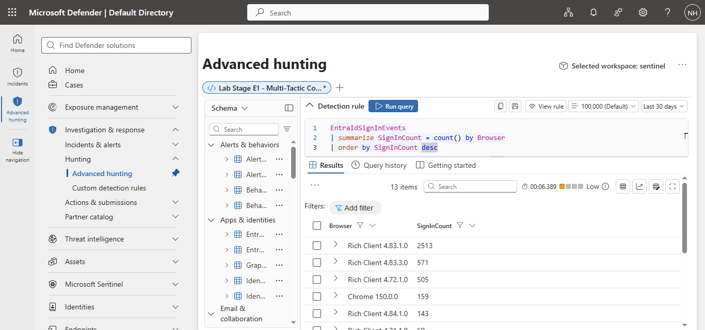

### Query Results

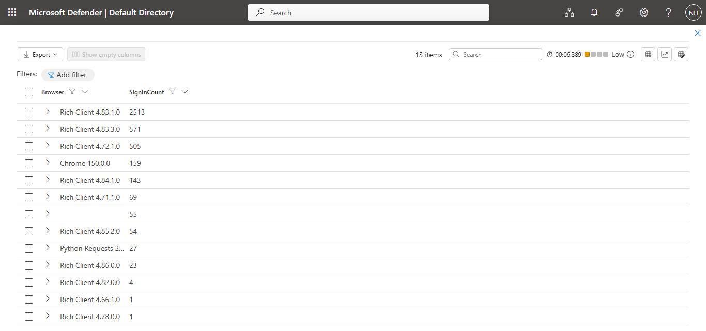
## Findings

A KQL query summarized Microsoft Entra ID authentication events by browser and client application.

The majority of authentication events originated from Microsoft Rich Client applications, with **Rich Client 4.83.1.0** recording **2,513 sign-ins**. Google Chrome also generated **159 authentication events**, indicating browser-based access to Microsoft services.

A small number of authentication events were associated with **Python Requests**, suggesting automated or scripted access. While this does not necessarily indicate malicious activity, it should be validated to ensure the automation is authorized.

The results establish a baseline of normal client applications used within the environment and provide valuable context for future authentication investigations.

---

# Step 10 – Failed Authentication Analysis

## Objective

Analyze Microsoft Entra ID authentication failures to identify common sign-in errors and determine whether they indicate suspicious activity.

## Query

[10-failed-signins-analysis.kql](queries/10-failed-signins-analysis.kql)

## Evidence

### Query Execution

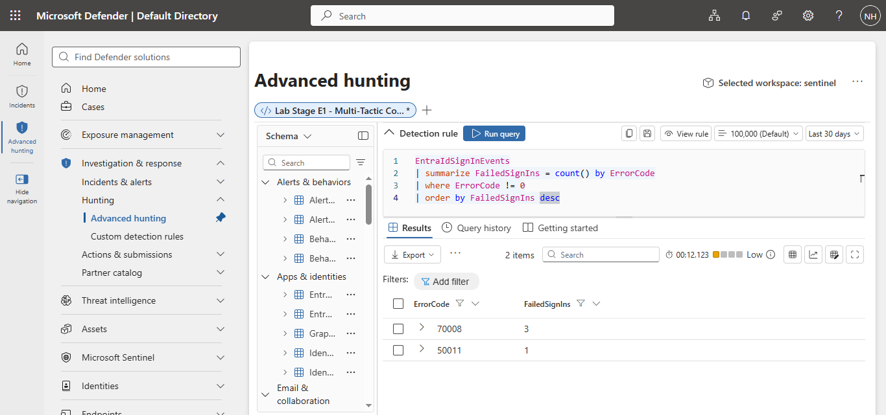

### Query Results

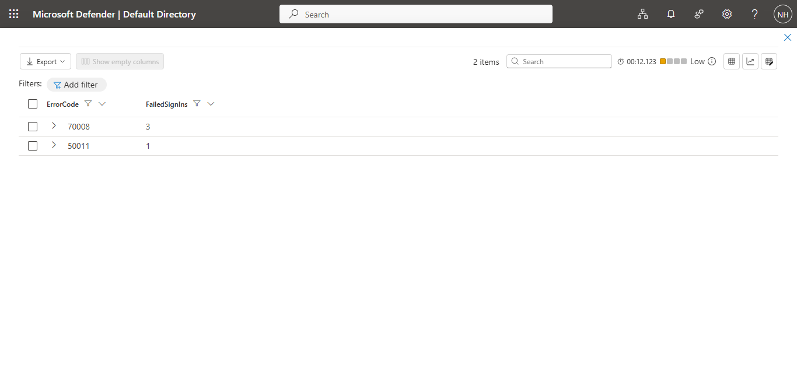

## Findings

A KQL query summarized failed authentication events by Azure/Entra ID error code.

The investigation identified two authentication error codes:

| Error Code | Failed Sign-ins |
|------------|----------------:|
| 70008 | 3 |
| 50011 | 1 |

A total of **4 failed authentication events** were observed. The most common error was **70008**, which is typically associated with expired or inactive refresh tokens. A single **50011** error indicated an application redirect URI configuration issue.

No evidence of password spraying, brute-force attacks, or widespread authentication failures was identified during the selected period.


## Skills Demonstrated

- Microsoft Sentinel
- Microsoft Entra ID
- Identity Monitoring
- Operating System Analysis
- Kusto Query Language (KQL)
- SOC Investigation

---

## Repository Contents

| Folder | Description |
|---------|-------------|
| queries | KQL queries used during the investigation |
| screenshots | Evidence captured from Microsoft Sentinel |
| notes | Detailed investigation notes |
| README.md | Project documentation |


