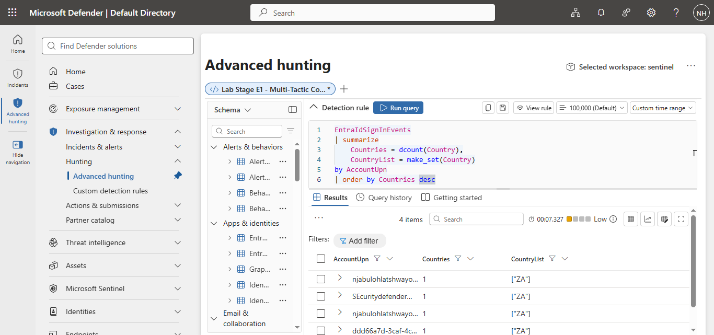

# Project 04 – Impossible Travel Investigation

## Overview

This project investigates Microsoft Entra ID sign-in logs to determine whether any user authenticated from multiple geographic locations, which could indicate an impossible travel scenario or compromised credentials.

---

# Investigation 01 – Impossible Travel Investigation

## Objective

Determine whether any user accounts authenticated from more than one country during the selected investigation period.

---

## Query

[01-impossible-travel-investigation.kql](queries/01-impossible-travel-investigation.kql)

```kql
EntraIdSignInEvents
| summarize
    Countries = dcount(Country),
    CountryList = make_set(Country)
by AccountUpn
| order by Countries desc
```

---

## Evidence



---

## Investigation Summary

Microsoft Entra ID authentication logs were analyzed to identify users authenticating from multiple geographic locations.

The investigation summarized authentication events by user account and calculated the number of unique countries from which each account authenticated.

### Findings

| Account | Countries | Country |
|---------|----------:|---------|
| njabulohlatshwayo... | 1 | ZA |
| Securitydefender... | 1 | ZA |
| ddd66a7d-3caf-4c... | 1 | ZA |

All observed authentication activity originated from South Africa (ZA).

No accounts authenticated from multiple countries.

---

## Analyst Assessment

Impossible travel detection is commonly used to identify potentially compromised accounts by looking for geographically impossible authentication activity.

During this investigation:

- No geographic anomalies were identified.
- Every observed account authenticated from only one country.
- No evidence of impossible travel was found.

Although no malicious activity was detected, the investigation successfully established a geographic authentication baseline for the monitored environment.

---

## Skills Demonstrated

- Microsoft Sentinel
- Microsoft Entra ID
- Identity Monitoring
- Authentication Investigation
- Geographic Analysis
- Kusto Query Language (KQL)
- Security Operations (SOC)

---

## Conclusion

This investigation demonstrated how Microsoft Sentinel can be used to analyze authentication activity and validate geographic sign-in behavior.

The investigation concluded that all observed authentication activity originated from South Africa, providing no evidence of impossible travel during the selected investigation period.
