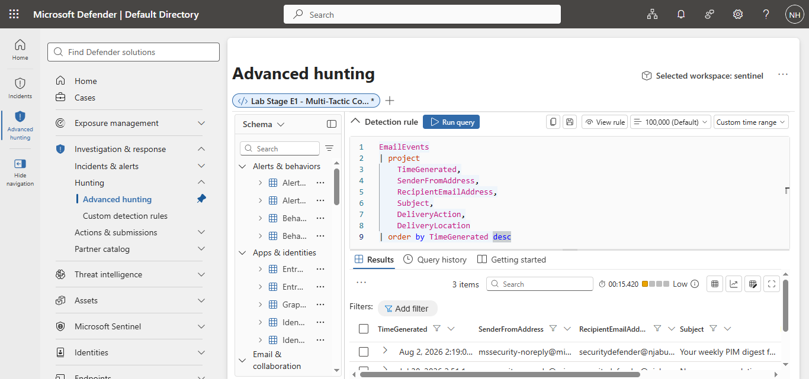
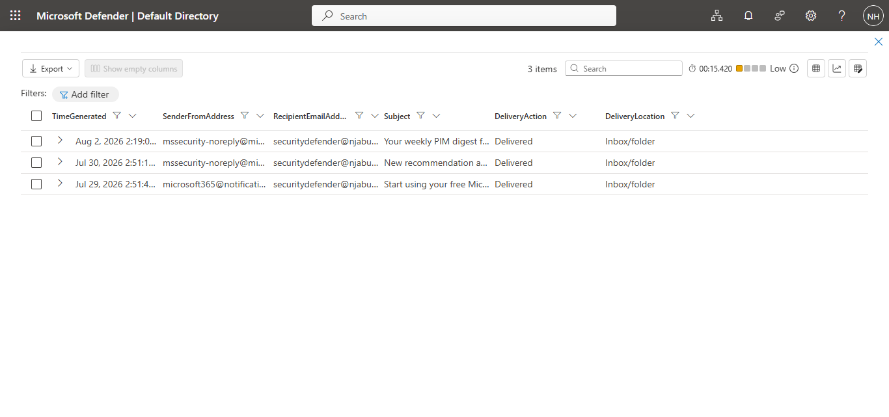

# Project 05 – Email Security Investigation

## Overview

This project investigates recent email activity using Microsoft Defender for Office 365 data stored in Microsoft Sentinel.

The objective was to review recently processed emails and determine whether any suspicious or potentially malicious messages were delivered to users.

---

# Investigation 01 – Email Security Investigation

## Objective

Review recent email activity and identify potential phishing or malicious email activity.

---

## Query

[01-email-security-investigation.kql](queries/01-email-security-investigation.kql)

```kql
EmailEvents
| project
    TimeGenerated,
    SenderFromAddress,
    RecipientEmailAddress,
    Subject,
    DeliveryAction,
    DeliveryLocation
| order by TimeGenerated desc
```

---

## Evidence

### Query



### Results



---

## Investigation Summary

Recent email activity was reviewed using the EmailEvents table.

The investigation examined:

- Sender email addresses
- Recipient email addresses
- Email subjects
- Delivery actions
- Delivery locations

Three recent email events were identified.

All messages originated from legitimate Microsoft notification services.

No suspicious sender domains, phishing indicators or malicious delivery actions were identified.

---

## Analyst Assessment

The reviewed email activity appears to consist entirely of legitimate Microsoft service notifications.

All emails were successfully delivered to the recipient inbox and no messages were quarantined or blocked.

No evidence of phishing or malicious email activity was observed during this investigation.

---

## Skills Demonstrated

- Microsoft Sentinel
- Microsoft Defender for Office 365
- Email Security
- Email Log Analysis
- Kusto Query Language (KQL)
- Security Operations (SOC)

---

## Conclusion

This investigation demonstrated how Microsoft Sentinel can be used to review email activity and validate the legitimacy of recently delivered messages.

Based on the available evidence, no suspicious email activity was identified during the selected investigation period.
