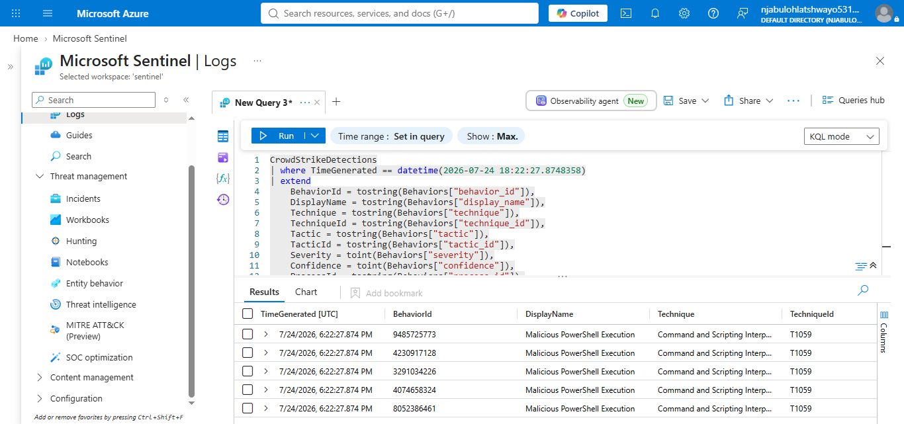
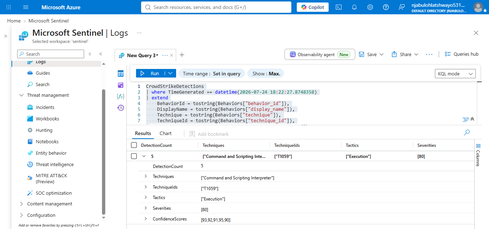
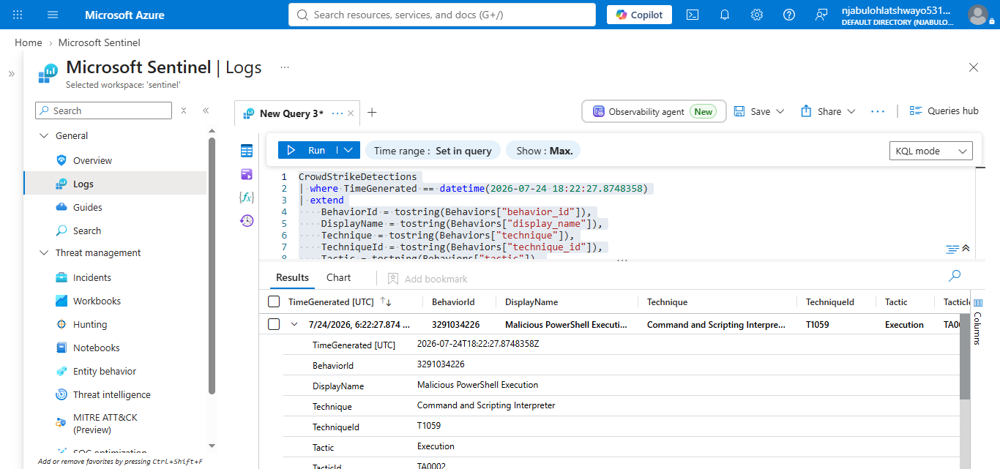

# Project 06 – CrowdStrike Detection Validation

## Overview

This project validates CrowdStrike detections ingested into Microsoft Sentinel.

The investigation focused on CrowdStrike behavior data, particularly detections associated with PowerShell execution. The objective was to confirm that CrowdStrike detections were available in Microsoft Sentinel, identify the techniques and tactics involved, and inspect the underlying behavior details.

The investigation used KQL queries in Microsoft Sentinel to validate the CrowdStrike data and extract useful detection evidence.

---

## Objectives

- Validate CrowdStrike detections in Microsoft Sentinel.
- Identify detected MITRE ATT&CK techniques and tactics.
- Identify high-severity detections.
- Validate PowerShell-related detections.
- Inspect CrowdStrike behavior details.
- Extract useful indicators such as process IDs, parent process IDs, command lines, file paths and SHA-256 hashes.
- Document the investigation findings for SOC analysis.

---

## Data Source

**Data source:** CrowdStrike

**Microsoft Sentinel table:**

`CrowdStrikeDetections`

The CrowdStrike data contained behavior information including:

- Behavior ID
- Technique
- Technique ID
- Tactic
- Tactic ID
- Severity
- Confidence
- Process ID
- Parent Process ID
- Command line
- File path
- Filename
- SHA-256
- User ID
- Detection timestamp

---

## Investigation Timeline

The CrowdStrike records were ingested into Microsoft Sentinel with a `TimeGenerated` value of:

**24 July 2026, 18:22:27 UTC**

The underlying behavior records also contained their own detection timestamps. This difference is important because `TimeGenerated` represents the time the record was available in Sentinel, while the embedded behavior timestamp represents the original CrowdStrike behavior time.

---

## Detection Validation

The CrowdStrike detection data contained **5 detections** associated with:

**MITRE ATT&CK Technique:** Command and Scripting Interpreter

**Technique ID:** T1059

**Tactic:** Execution

**Severity:** 80

The five detections had confidence scores of:

- 93
- 92
- 91
- 95
- 90

This confirms that the CrowdStrike detections were successfully available in Microsoft Sentinel and contained useful MITRE ATT&CK metadata.

### Detection Summary

| Detection Count | Technique | Technique ID | Tactic | Severity |
|---|---|---|---|---|
| 5 | Command and Scripting Interpreter | T1059 | Execution | 80 |

---

## PowerShell Detection Validation

The investigation identified multiple CrowdStrike detections with the display name:

`Malicious PowerShell Execution`

The detected technique was:

`Command and Scripting Interpreter`

with technique ID:

`T1059`

The associated tactic was:

`Execution`

One of the validated detections contained the following process information:

- **Process:** `powershell.exe`
- **File path:** `C:\Windows\System32\WindowsPowerShell\v1.0\powershell.exe`
- **Process ID:** `45992`
- **Parent Process ID:** `1541`
- **Severity:** `80`
- **Confidence:** `95`
- **Technique:** `Command and Scripting Interpreter`
- **Technique ID:** `T1059`
- **Tactic:** `Execution`

The detection also contained a PowerShell command using encoded content:

`powershell.exe -enc SQBuAHYAbwBrAGUALQBXAGUAYgBSAGUAcQB1AGUAcwB0AA==`

The presence of encoded PowerShell is important during SOC investigations because attackers can use PowerShell encoding to obscure commands and make basic command-line inspection more difficult.

---

## Behavior Details

The CrowdStrike behavior data provided additional information that could be used for investigation and correlation.

Example fields included:

- `behavior_id`
- `cmdline`
- `confidence`
- `display_name`
- `filename`
- `filepath`
- `parent_process_id`
- `process_id`
- `severity`
- `sha256`
- `tactic`
- `tactic_id`
- `technique`
- `technique_id`
- `timestamp`
- `user_id`

This information provides useful context for determining what process executed, which process started it, which account was involved and what file was executed.

---

## MITRE ATT&CK Mapping

The validated detections mapped to:

| MITRE ATT&CK Field | Value |
|---|---|
| Tactic | Execution |
| Technique | Command and Scripting Interpreter |
| Technique ID | T1059 |
| Detection Type | Malicious PowerShell Execution |
| Severity | 80 |
| Confidence | 90–95 |

The detections therefore represent activity associated with the **Execution** stage of the MITRE ATT&CK framework.

---

## Key Findings

### Finding 1 – CrowdStrike data is available in Sentinel

CrowdStrike detection records were successfully identified in the `CrowdStrikeDetections` table.

### Finding 2 – PowerShell activity was detected

Multiple detections were identified as **Malicious PowerShell Execution**.

### Finding 3 – The detections were high severity

The validated detections had a severity value of **80**.

### Finding 4 – High confidence detections

The five validated detections had confidence scores between **90 and 95**.

### Finding 5 – Encoded PowerShell was present

One validated detection contained an encoded PowerShell command using the `-enc` parameter.

### Finding 6 – Process information was available

The detection included process ID and parent process ID information, allowing the activity to be investigated further through process relationships.

---

## Investigation Assessment

The CrowdStrike data represents potentially suspicious PowerShell execution and should be treated as security-relevant activity.

The combination of:

- Malicious PowerShell Execution
- Severity 80
- High confidence scores
- Encoded PowerShell
- Process and parent-process information

provides sufficient evidence to warrant additional investigation.

However, the detection itself does not automatically prove that the activity was malicious in the environment. Additional investigation would be required to determine the source, user context, parent process, command purpose, affected host and whether any follow-on activity occurred.

---

## Recommended SOC Investigation Steps

A SOC analyst should investigate:

1. The affected host.
2. The user associated with the PowerShell process.
3. The parent process.
4. The complete PowerShell command.
5. The decoded PowerShell command.
6. The SHA-256 hash.
7. Related CrowdStrike detections.
8. Windows Security events around the same time.
9. Network connections generated by the process.
10. Any subsequent process creation activity.

Correlating the CrowdStrike detection with other Microsoft Sentinel data sources can help determine whether the PowerShell execution was part of a larger attack chain.

---

## Screenshots

### 01 – CrowdStrike PowerShell Validation

This screenshot shows the validation of the CrowdStrike PowerShell detection.

---

### 02 – CrowdStrike Validation Summary

This screenshot shows the summarized CrowdStrike detection validation results, including the detected technique, tactic, severity and confidence information.

---

### 03 – PowerShell Behavior Details

This screenshot shows the detailed CrowdStrike behavior information for the PowerShell detection, including process information and other detection metadata.

---

## Conclusion

The investigation successfully validated CrowdStrike detections in Microsoft Sentinel.

The analysis identified five detections associated with the **Command and Scripting Interpreter (T1059)** technique under the **Execution** tactic. The detections had severity 80 and confidence scores ranging from 90 to 95.

The investigation also identified multiple **Malicious PowerShell Execution** detections, including a detection containing an encoded PowerShell command.

The available process, command-line, hash and MITRE ATT&CK information provides a useful foundation for further SOC investigation and cross-source correlation.

This project demonstrates how Microsoft Sentinel can be used to validate and investigate endpoint detection data from CrowdStrike.
