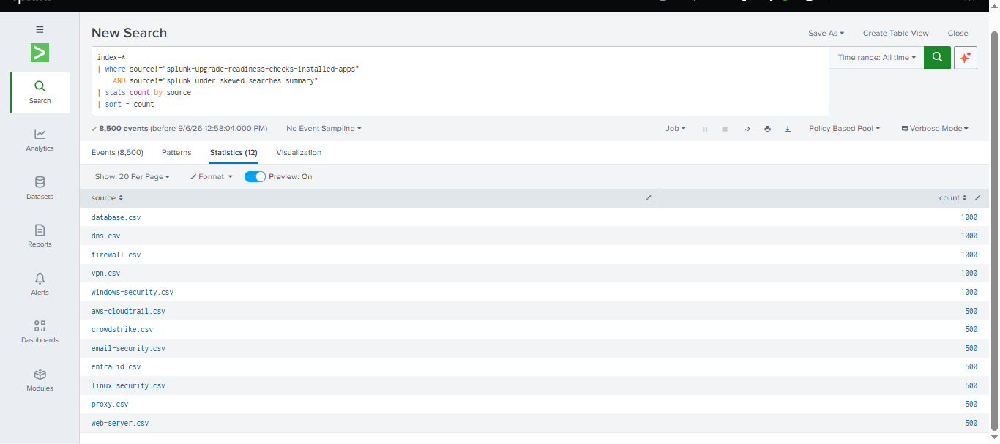
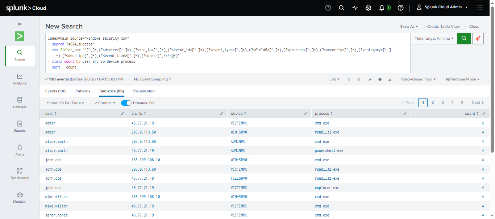
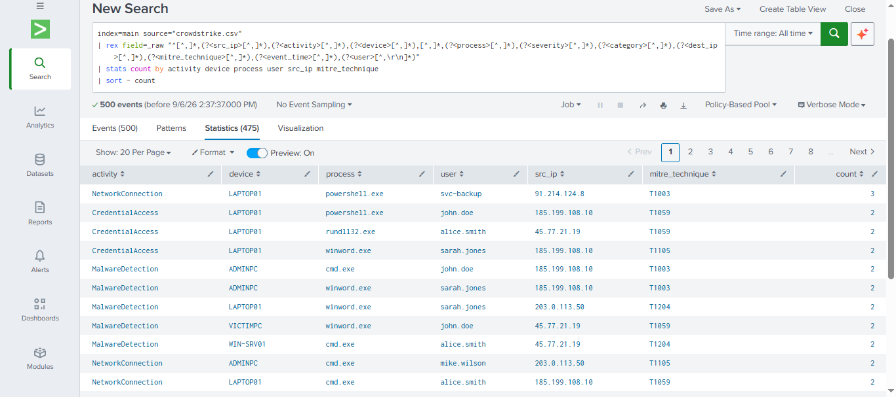

# Splunk Authentication Investigation

## Overview

This project demonstrates a practical Security Operations Center (SOC) investigation using **Splunk**.

The investigation focuses on authentication activity and endpoint security events. SPL was used to search, extract, filter, and summarize security data to identify users, devices, processes, source IP addresses, and MITRE ATT&CK techniques.

The project is designed to demonstrate practical skills relevant to a **Junior SOC Analyst / Tier 1 SOC Analyst** role.

---

## Investigation Objectives

The objectives of this investigation are to:

* Analyze authentication activity
* Identify successful authentication events
* Investigate endpoint security activity
* Identify users and devices involved in security events
* Analyze source IP addresses
* Identify processes involved in suspicious activity
* Map endpoint activity to MITRE ATT&CK techniques
* Document investigation findings
* Preserve investigation evidence using screenshots

---

## Data Sources

The investigation uses the following security datasets:

| Dataset                | Purpose                                    |
| ---------------------- | ------------------------------------------ |
| `windows-security.csv` | Windows authentication and security events |
| `crowdstrike.csv`      | Endpoint detection and response activity   |

The datasets are indexed in Splunk under:

```text
index=main
```

---

# Investigation 01 — Authentication Overview

## Objective

The first investigation provides an overview of authentication-related activity from Windows Security logs.

The goal is to understand authentication patterns involving users, devices, source IP addresses, and processes.

## Query

**FILE**

```text
queries/01-authentication-overview.spl
```

The query uses SPL to search and summarize authentication-related activity.

## Notes

**FILE**

```text
notes/01-authentication-overview-notes.md
```

The notes document the investigation methodology, security relevance, and analyst observations.

## Evidence

**Screenshot**

```text
screenshots/01-authentication-overview-results.png
```



---

# Investigation 02 — Successful Authentication

## Objective

The second investigation focuses on successful Windows authentication events.

The investigation uses the `4624_success` event type and summarizes authentication activity by user, source IP address, device, and process.

## SPL Query

```spl
index=main source="windows-security.csv" 
| search "4624_success" 
| rex field=_raw "^[^,]*,(?<device>[^,]*),(?<src_ip>[^,]*),(?<event_id>[^,]*),(?<event_type>[^,]*),(?<field6>[^,]*),(?<process>[^,]*),(?<severity>[^,]*),(?<category>[^,]*),(?<dest_ip>[^,]*),(?<event_time>[^,]*),(?<user>[^,\r\n]*)" 
| stats count by user src_ip device process 
| sort - count
```

## Investigation Fields

The query extracts and analyzes:

* `user`
* `src_ip`
* `device`
* `process`

The `stats` command groups the events and counts how frequently each combination occurs.

## Security Relevance

Successful authentication events are important during security investigations because an attacker using compromised credentials may authenticate successfully rather than generate repeated failed-login events.

An analyst can investigate:

* Unexpected users
* Unusual source IP addresses
* Unexpected devices
* Suspicious processes
* Repeated authentication activity

## Notes

**FILE**

```text
notes/02-successful-authentication-notes.md
```

## Evidence

**Screenshot**

```text
screenshots/02-successful-authentication-results.png
```



---

# Investigation 03 — Endpoint Security Investigation

## Objective

The third investigation analyzes endpoint security activity collected from CrowdStrike EDR logs.

The investigation correlates endpoint activity with:

* Users
* Devices
* Processes
* Source IP addresses
* MITRE ATT&CK techniques
* Activity frequency

## SPL Query

```spl
index=main source="crowdstrike.csv"
| rex field=_raw "^[^,]*,(?<src_ip>[^,]*),(?<activity>[^,]*),(?<device>[^,]*),[^,]*,(?<process>[^,]*),(?<severity>[^,]*),(?<category>[^,]*),(?<dest_ip>[^,]*),(?<mitre_technique>[^,]*),(?<event_time>[^,]*),(?<user>[^,\r\n]*)"
| stats count by activity device process user src_ip mitre_technique
| sort - count
```

## Investigation Fields

The query extracts:

| Field             | Description                       |
| ----------------- | --------------------------------- |
| `activity`        | Type of endpoint activity         |
| `device`          | Endpoint involved                 |
| `process`         | Process associated with the event |
| `user`            | User associated with the activity |
| `src_ip`          | Source IP address                 |
| `mitre_technique` | MITRE ATT&CK technique            |
| `count`           | Number of matching events         |

## Observed Activity

The investigation identified activity including:

* Network connections
* Credential access
* PowerShell activity
* Malware detection

Processes observed included:

* `powershell.exe`
* `rundll32.exe`
* `winword.exe`
* `cmd.exe`

## Security Relevance

Endpoint telemetry can help an SOC analyst identify potentially suspicious behavior.

For example, PowerShell, `rundll32.exe`, Microsoft Word, and command-line activity can provide useful indicators during an endpoint investigation.

The analyst should investigate unusual combinations of:

```text
User → Device → Process → Source IP → Activity → MITRE Technique
```

## Notes

**FILE**

```text
notes/03-endpoint-security-investigation-notes.md
```

## Evidence

**Screenshot**

```text
screenshots/03-endpoint-security-investigation-results.png
```



---

# Investigation Methodology

The investigations follow a basic SOC investigation workflow:

### 1. Identify the Data Source

Determine which security log contains the information required for the investigation.

### 2. Search the Data

Use Splunk SPL to locate relevant events.

### 3. Extract Fields

Use `rex` to extract useful fields from raw CSV events.

### 4. Filter Events

Use search conditions to focus on relevant security activity.

### 5. Aggregate Events

Use `stats` to group related events and identify repeated activity.

### 6. Sort Results

Sort results by event frequency to prioritize activity for investigation.

### 7. Analyze

Review users, devices, processes, IP addresses, and security techniques for unusual behavior.

### 8. Document

Record the investigation methodology and preserve screenshots as evidence.

---

# SPL Techniques Demonstrated

This project demonstrates practical use of:

* `search`
* `rex`
* `stats`
* `sort`
* Field extraction
* Event filtering
* Event aggregation
* Source filtering
* Security log analysis

---

# SOC Analyst Skills Demonstrated

This project demonstrates:

* Authentication investigation
* Windows Security log analysis
* Endpoint security investigation
* CrowdStrike EDR analysis
* User activity analysis
* Device analysis
* Process analysis
* Source IP investigation
* MITRE ATT&CK analysis
* SPL development
* Security evidence documentation
* Investigation reporting

---

# Project Structure

```text
01-authentication-investigation/
│
├── queries/
│   ├── 01-authentication-overview.spl
│   ├── 02-successful-authentication.spl
│   └── 03-endpoint-security-investigation.spl
│
├── screenshots/
│   ├── 01-authentication-overview-results.png
│   ├── 02-successful-authentication-results.png
│   └── 03-endpoint-security-investigation-results.png
│
├── notes/
│   ├── 01-authentication-overview-notes.md
│   ├── 02-successful-authentication-notes.md
│   └── 03-endpoint-security-investigation-notes.md
│
└── README.md
```

---

# Analyst Takeaway

Authentication and endpoint telemetry provide valuable evidence for identifying potentially compromised accounts, suspicious processes, unusual source IP addresses, and malicious endpoint activity.

Using SPL to extract and correlate security data allows an SOC analyst to move from raw log events to structured investigation results.

This project demonstrates the practical workflow of:

```text
Raw Security Logs
        ↓
SPL Search
        ↓
Field Extraction
        ↓
Event Aggregation
        ↓
Security Analysis
        ↓
Evidence
        ↓
Investigation Documentation
```

---

# Evidence Summary

| Investigation                   | Query                                    | Notes                                         | Screenshot                                       |
| ------------------------------- | ---------------------------------------- | --------------------------------------------- | ------------------------------------------------ |
| Authentication Overview         | `01-authentication-overview.spl`         | `01-authentication-overview-notes.md`         | `01-authentication-overview-results.png`         |
| Successful Authentication       | `02-successful-authentication.spl`       | `02-successful-authentication-notes.md`       | `02-successful-authentication-results.png`       |
| Endpoint Security Investigation | `03-endpoint-security-investigation.spl` | `03-endpoint-security-investigation-notes.md` | `03-endpoint-security-investigation-results.png` |

---

## Project Status

**Completed investigations:** 3

**Platform:** Splunk

**Focus:** Authentication & Endpoint Security

**Role:** SOC Analyst / Security Operations

**Evidence:** SPL queries, investigation notes, and screenshots

