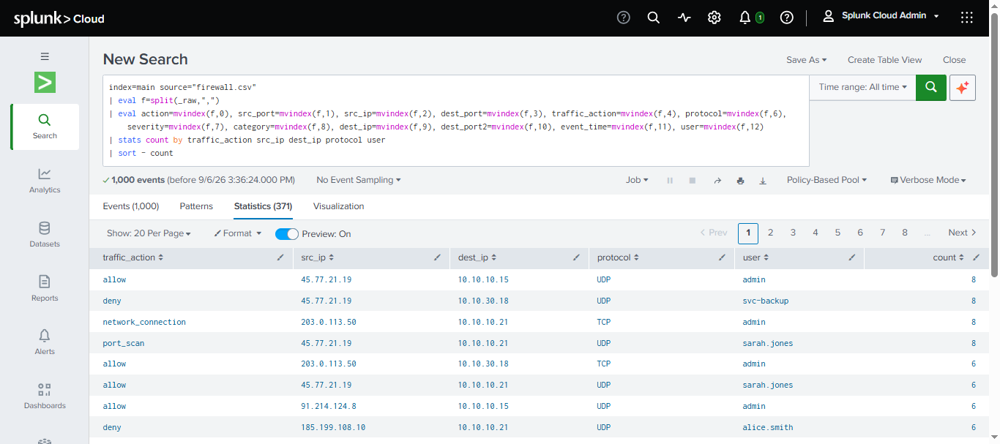
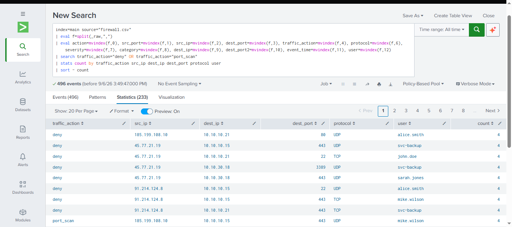
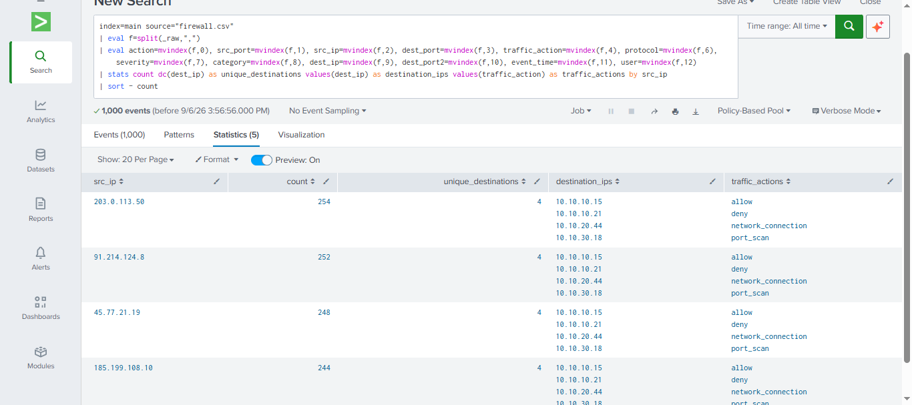

# Network & Firewall Investigation

## Overview

This project demonstrates a Splunk-based investigation of firewall and network traffic.

The investigation focuses on identifying normal and potentially suspicious network activity, including denied connections, port scanning, and repeated activity from external IP addresses.

## Objectives

* Analyse firewall traffic using Splunk SPL.
* Identify allowed and denied network connections.
* Detect potential port scanning activity.
* Investigate external source IP addresses.
* Identify internal systems receiving network traffic.
* Practise SOC investigation and threat-hunting techniques.

## Data Source

**Splunk Index:** `main`

**Log Source:** `firewall.csv`

**Security Technology:** Palo Alto Firewall

## Project Structure

```text
02-network-firewall-investigation/
│
├── queries/
│   ├── 01-firewall-traffic-overview.spl
│   ├── 02-suspicious-firewall-activity.spl
│   └── 03-external-ip-investigation.spl
│
├── screenshots/
│   ├── 01-firewall-traffic-overview-results.png
│   ├── 02-suspicious-firewall-activity-results.png
│   └── 03-external-ip-investigation-results.png
│
├── notes/
│   ├── 01-firewall-traffic-overview-notes.md
│   ├── 02-suspicious-firewall-activity-notes.md
│   └── 03-external-ip-investigation-notes.md
│
└── README.md
```

---

# Investigation 01 — Firewall Traffic Overview

### Objective

Review firewall traffic and identify communication patterns between external source IP addresses and internal systems.

### SPL Query

```spl
index=main source="firewall.csv"
| eval f=split(_raw,",")
| eval action=mvindex(f,0), src_port=mvindex(f,1), src_ip=mvindex(f,2), dest_port=mvindex(f,3), traffic_action=mvindex(f,4), protocol=mvindex(f,6), severity=mvindex(f,7), category=mvindex(f,8), dest_ip=mvindex(f,9), dest_port2=mvindex(f,10), event_time=mvindex(f,11), user=mvindex(f,12)
| stats count by traffic_action src_ip dest_ip protocol user
| sort - count
```

### Results



### Analyst Observation

The investigation identified different types of firewall activity, including allowed traffic, denied traffic, network connections, and port scanning.

---

# Investigation 02 — Suspicious Firewall Activity

### Objective

Focus on firewall events that may require additional security investigation.

### SPL Query

```spl
index=main source="firewall.csv"
| eval f=split(_raw,",")
| eval action=mvindex(f,0), src_port=mvindex(f,1), src_ip=mvindex(f,2), dest_port=mvindex(f,3), traffic_action=mvindex(f,4), protocol=mvindex(f,6), severity=mvindex(f,7), category=mvindex(f,8), dest_ip=mvindex(f,9), dest_port2=mvindex(f,10), event_time=mvindex(f,11), user=mvindex(f,12)
| search traffic_action="deny" OR traffic_action="port_scan"
| stats count by traffic_action src_ip dest_ip dest_port protocol user
| sort - count
```

### Results



### Analyst Observation

The results identified denied connections and `port_scan` events involving external source IP addresses and internal destination systems.

Port `3389` was also observed in the investigation and is associated with RDP traffic.

---

# Investigation 03 — External IP Investigation

### Objective

Identify external source IP addresses generating repeated firewall activity and determine the internal systems they contacted.

### SPL Query

```spl
index=main source="firewall.csv"
| eval f=split(_raw,",")
| eval action=mvindex(f,0), src_port=mvindex(f,1), src_ip=mvindex(f,2), dest_port=mvindex(f,3), traffic_action=mvindex(f,4), protocol=mvindex(f,6), severity=mvindex(f,7), category=mvindex(f,8), dest_ip=mvindex(f,9), dest_port2=mvindex(f,10), event_time=mvindex(f,11), user=mvindex(f,12)
| stats count dc(dest_ip) as unique_destinations values(dest_ip) as destination_ips values(traffic_action) as traffic_actions by src_ip
| sort - count
```

### Results



### Analyst Observation

Several external source IP addresses generated repeated activity against multiple internal destination systems.

The investigation also identified different traffic actions associated with these source IP addresses, including allowed traffic, denied traffic, network connections, and port scanning.

---

# SOC Investigation Findings

The investigation demonstrated how Splunk can be used to analyse firewall logs and prioritize potentially suspicious network activity.

Key investigation areas included:

* Repeated external connections
* Denied network traffic
* Port scanning
* Multiple internal destinations
* RDP-related traffic
* External source IP activity
* User-associated network events

## Recommended Next Steps

A SOC analyst could continue the investigation by correlating the suspicious IP addresses with:

* Windows Security logs
* CrowdStrike endpoint events
* VPN authentication logs
* DNS activity
* Proxy logs
* Email security events
* Entra ID authentication logs

Correlation across multiple data sources can help determine whether firewall activity represents legitimate traffic, reconnaissance, or an attempted compromise.

## Skills Demonstrated

* Splunk SPL
* Firewall log analysis
* Network traffic investigation
* Source IP investigation
* Port scan detection
* Security event correlation
* SOC investigation methodology
* Evidence-based analysis

## Conclusion

This project demonstrates a practical SOC workflow for investigating firewall activity in Splunk.

The investigation progresses from a broad overview of firewall traffic to suspicious activity detection and finally to external IP investigation.

The techniques demonstrated here can be applied when investigating network reconnaissance, suspicious connections, and potential unauthorized access.
