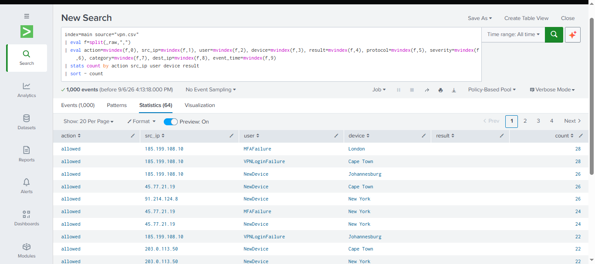
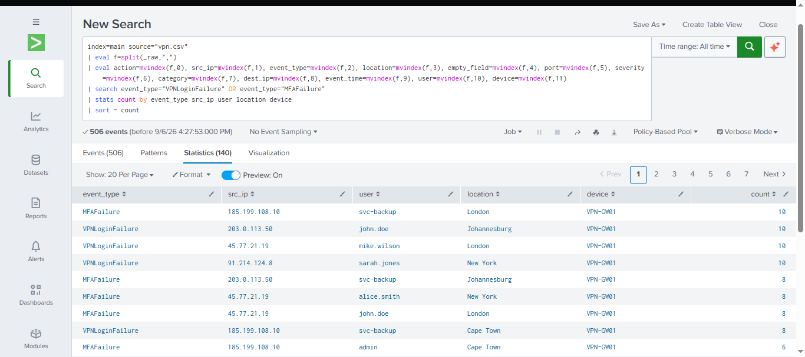
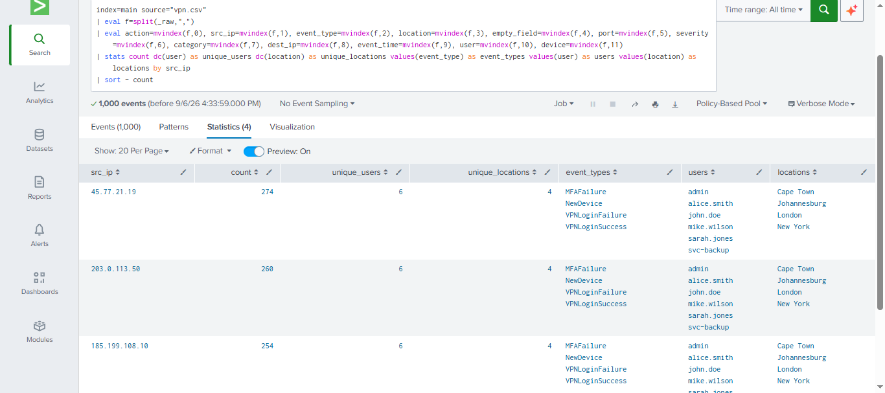
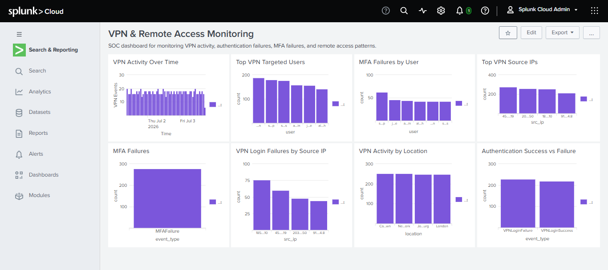

# Splunk Project 03 – VPN & Remote Access Investigation

## Overview

This project demonstrates a practical **Security Operations Center (SOC) investigation of VPN and remote-access activity using Splunk**.

The investigation analyzes VPN authentication events to identify successful and failed logins, MFA failures, high-volume source IP addresses, targeted user accounts, geographic activity, and changes in VPN activity over time.

The investigation also includes a **Splunk monitoring dashboard** containing eight visualizations that provide centralized visibility into VPN and remote-access activity.

The project demonstrates how a SOC analyst can move from initial log analysis to targeted investigation and visual monitoring.

---

# Objectives

The objectives of this investigation were to:

* Analyze VPN authentication activity.
* Identify successful and failed VPN logins.
* Investigate MFA failures.
* Identify high-volume VPN source IP addresses.
* Identify users associated with VPN activity.
* Analyze VPN activity by geographic location.
* Analyze VPN activity over time.
* Build a Splunk monitoring dashboard.
* Document investigation findings and SOC recommendations.
* Demonstrate practical Splunk SPL investigation techniques.

---

# Data Source

| Field        | Value               |
| ------------ | ------------------- |
| Splunk Index | `main`              |
| Source       | `vpn.csv`           |
| Log Type     | VPN / Remote Access |
| Platform     | Splunk              |

The VPN dataset contains fields representing authentication and remote-access activity, including:

* Source IP address
* Event type
* Geographic location
* Port
* Severity
* Category
* Destination IP
* Event timestamp
* Username
* Device

### VPN Field Mapping

The raw CSV data was parsed using `split()` and `mvindex()`.

```text
0  action
1  src_ip
2  event_type
3  location
4  empty_field
5  port
6  severity
7  category
8  dest_ip
9  event_time
10 user
11 device
```

This mapping was used consistently in the final investigation queries.

---

# Investigation Methodology

The investigation followed a structured SOC workflow:

```text
VPN Logs
   |
   v
Data Exploration
   |
   v
Authentication Analysis
   |
   v
Failed Login Analysis
   |
   v
Source IP Analysis
   |
   v
User Analysis
   |
   v
MFA Analysis
   |
   v
Geographic Analysis
   |
   v
Time-Based Analysis
   |
   v
Dashboard Development
   |
   v
SOC Investigation Recommendations
```

The investigation started with broad VPN visibility and progressively focused on authentication failures, source IP addresses, user accounts, MFA failures, and geographic activity.

---

# Investigation 01 – VPN Authentication Overview

## Objective

Establish an overview of VPN authentication activity and identify the different types of remote-access events occurring in the environment.

## SPL Query

```spl
index=main source="vpn.csv"
| eval f=split(_raw,",")
| eval action=mvindex(f,0), src_ip=mvindex(f,1), event_type=mvindex(f,2), location=mvindex(f,3), empty_field=mvindex(f,4), port=mvindex(f,5), severity=mvindex(f,6), category=mvindex(f,7), dest_ip=mvindex(f,8), event_time=mvindex(f,9), user=mvindex(f,10), device=mvindex(f,11)
| stats count by action src_ip event_type location user device
| sort - count
```

## Evidence



## Key Observations

The investigation identified several types of VPN and remote-access activity, including:

* `VPNLoginSuccess`
* `VPNLoginFailure`
* `MFAFailure`
* `NewDevice`

Activity involved multiple:

* Users
* Source IP addresses
* Devices
* Geographic locations

## SOC Relevance

An authentication overview provides the initial visibility required to identify accounts, source addresses, and event types that may require deeper investigation.

---

# Investigation 02 – VPN Login and MFA Failures

## Objective

Identify failed VPN authentication and MFA events that could represent unsuccessful unauthorized-access attempts.

## SPL Query

```spl
index=main source="vpn.csv"
| eval f=split(_raw,",")
| eval action=mvindex(f,0), src_ip=mvindex(f,1), event_type=mvindex(f,2), location=mvindex(f,3), empty_field=mvindex(f,4), port=mvindex(f,5), severity=mvindex(f,6), category=mvindex(f,7), dest_ip=mvindex(f,8), event_time=mvindex(f,9), user=mvindex(f,10), device=mvindex(f,11)
| search event_type="VPNLoginFailure" OR event_type="MFAFailure"
| stats count by event_type src_ip user location device
| sort - count
```

## Evidence



## Key Observations

The query identified VPN login failures and MFA failures involving multiple source IP addresses and user accounts.

Observed accounts included:

* `admin`
* `alice.smith`
* `john.doe`
* `mike.wilson`
* `sarah.jones`
* `svc-backup`

Observed locations included:

* Johannesburg
* Cape Town
* London
* New York

## SOC Relevance

Repeated authentication or MFA failures can be associated with:

* Password spraying
* Brute-force attempts
* Credential stuffing
* Compromised credentials
* MFA abuse
* Unauthorized remote-access attempts

These events should be correlated with successful authentication to determine whether access was eventually obtained.

---

# Investigation 03 – VPN Source IP Investigation

## Objective

Identify source IP addresses generating large volumes of VPN activity and determine the number of users, locations, and event types associated with each source.

## SPL Query

```spl
index=main source="vpn.csv"
| eval f=split(_raw,",")
| eval action=mvindex(f,0), src_ip=mvindex(f,1), event_type=mvindex(f,2), location=mvindex(f,3), empty_field=mvindex(f,4), port=mvindex(f,5), severity=mvindex(f,6), category=mvindex(f,7), dest_ip=mvindex(f,8), event_time=mvindex(f,9), user=mvindex(f,10), device=mvindex(f,11)
| stats count dc(user) as unique_users dc(location) as unique_locations values(event_type) as event_types values(user) as users values(location) as locations by src_ip
| sort - count
```

## Evidence



## Key Findings

The investigation identified four high-volume VPN source IP addresses:

| Source IP        | Events | Unique Users | Unique Locations |
| ---------------- | -----: | -----------: | ---------------: |
| `45.77.21.19`    |    260 |            6 |                4 |
| `203.0.113.50`   |    260 |            6 |                4 |
| `185.199.108.10` |    254 |            6 |                4 |
| `91.214.124.8`   |    244 |            6 |                4 |

Each source IP was associated with six users and four geographic locations.

The observed event types included:

* VPN login failures
* MFA failures
* New-device events
* Successful VPN logins

## SOC Relevance

A source IP generating large volumes of VPN activity across multiple accounts and locations warrants additional investigation.

Possible areas of investigation include:

* Credential compromise
* Password spraying
* MFA abuse
* Unauthorized remote access
* Compromised VPN credentials
* Attempts to access multiple accounts

The presence of both failed and successful authentication activity is particularly important and should be investigated further.

---

# Investigation 04 – Top VPN Targeted Users

## Objective

Identify the user accounts associated with the highest volume of VPN activity.

## SPL Query

```spl
index=main source="vpn.csv"
| eval f=split(_raw,",")
| eval user=mvindex(f,10)
| stats count by user
| sort - count
| head 10
```

## Results

The investigation identified the following high-volume accounts:

* `mike.wilson`
* `svc-backup`
* `sarah.jones`
* `admin`
* `john.doe`
* `alice.smith`

## SOC Relevance

High-volume accounts should be reviewed in context.

Administrative and service accounts deserve additional attention because they may have elevated privileges or provide access to important systems.

Account activity should be correlated with:

* Authentication results
* Source IP addresses
* MFA events
* Device activity
* Geographic location
* Authentication timestamps

---

# Investigation 05 – MFA Failures

## Objective

Determine the number of MFA failure events recorded in the VPN dataset.

## SPL Query

```spl
index=main source="vpn.csv"
| eval f=split(_raw,",")
| eval event_type=mvindex(f,2)
| search event_type="MFAFailure"
| stats count by event_type
```

## Finding

The investigation identified:

**278 MFA failures**

## SOC Relevance

Repeated MFA failures may indicate:

* Incorrect authentication attempts
* Credential attacks
* MFA fatigue attempts
* Unauthorized access attempts
* Authentication configuration problems

MFA failures should be investigated alongside the associated user, source IP, device, and timestamp.

---

# Investigation 06 – VPN Login Failures by Source IP

## Objective

Identify which source IP addresses generated the highest number of failed VPN login attempts.

## SPL Query

```spl
index=main source="vpn.csv"
| eval f=split(_raw,",")
| eval event_type=mvindex(f,2)
| eval src_ip=mvindex(f,1)
| search event_type="VPNLoginFailure"
| stats count by src_ip
| sort - count
| head 10
```

## Results

| Source IP        | VPN Login Failures |
| ---------------- | -----------------: |
| `185.199.108.10` |                 76 |
| `45.77.21.19`    |                 60 |
| `203.0.113.50`   |                 48 |
| `91.214.124.8`   |                 44 |

### Highest-Failure Source

`185.199.108.10` generated the highest number of VPN login failures with:

**76 failed VPN login attempts**

## SOC Relevance

This source IP should be prioritized for further investigation.

The analyst should determine whether the activity represents:

* Brute-force activity
* Password spraying
* Credential attacks
* Unauthorized remote access

The source should also be correlated with successful VPN logins to determine whether authentication eventually succeeded.

---

# Investigation 07 – MFA Failures by User

## Objective

Identify which user accounts experienced the highest number of MFA failures.

## SPL Query

```spl
index=main source="vpn.csv"
| eval f=split(_raw,",")
| eval event_type=mvindex(f,2)
| eval user=mvindex(f,10)
| search event_type="MFAFailure"
| stats count by user
| sort - count
| head 10
```

## Results

| User          | MFA Failures |
| ------------- | -----------: |
| `svc-backup`  |           62 |
| `john.doe`    |           46 |
| `admin`       |           44 |
| `alice.smith` |           42 |
| `mike.wilson` |           42 |
| `sarah.jones` |           42 |

### Highest-Failure Account

The `svc-backup` account generated the highest number of MFA failures:

**62 MFA failures**

## SOC Relevance

The `svc-backup` account should be investigated to determine whether the activity is caused by:

* Incorrect credentials
* Expired credentials
* Automated processes
* Authentication configuration problems
* Unauthorized access attempts

Service-account activity should be validated against expected operational behavior.

---

# Investigation 08 – VPN Activity by Location

## Objective

Analyze VPN activity by geographic location.

## SPL Query

```spl
index=main source="vpn.csv"
| eval f=split(_raw,",")
| eval location=mvindex(f,3)
| stats count by location
| sort - count
```

## Results

| Location     | Events |
| ------------ | -----: |
| Cape Town    |    252 |
| New York     |    252 |
| Johannesburg |    248 |
| London       |    248 |

## SOC Relevance

Geographic analysis can help identify unusual remote-access behavior.

In a production environment, analysts should investigate:

* Unexpected countries or locations
* Multiple distant locations used by the same account
* Rapid authentication from geographically distant locations
* Unusual access compared with a user's normal behavior
* Potential impossible-travel scenarios

Geographic activity by itself does **not** prove malicious activity and should be correlated with authentication timestamps, users, devices, and business context.

---

# Investigation Summary

The investigation identified several notable patterns.

## Authentication

The dataset contained:

| Authentication Event | Count |
| -------------------- | ----: |
| VPN Login Failure    |   228 |
| VPN Login Success    |   218 |
| MFA Failure          |   278 |

The number of VPN login failures was higher than successful VPN logins.

## Source IP

The highest number of VPN login failures originated from:

`185.199.108.10`

with:

**76 failed VPN login attempts**

## User

The account with the highest number of MFA failures was:

`svc-backup`

with:

**62 MFA failures**

## Geographic Activity

VPN activity was observed across:

* Cape Town
* New York
* Johannesburg
* London

These observations provide areas for additional investigation but do not, by themselves, confirm malicious activity.

---

# Splunk Dashboard – VPN & Remote Access Monitoring

## Objective

A centralized Splunk dashboard was created to provide continuous visibility into VPN and remote-access activity.

### Dashboard Name

**VPN & Remote Access Monitoring**

### Dashboard Panels

|  # | Panel                             | Purpose                                              |
| -: | --------------------------------- | ---------------------------------------------------- |
|  1 | VPN Activity Over Time            | Identify changes and spikes in VPN activity          |
|  2 | Authentication Success vs Failure | Compare successful and failed VPN authentication     |
|  3 | Top VPN Source IPs                | Identify high-volume VPN sources                     |
|  4 | Top VPN Targeted Users            | Identify highly active accounts                      |
|  5 | MFA Failures                      | Monitor MFA failure volume                           |
|  6 | VPN Login Failures by Source IP   | Identify sources generating failed logins            |
|  7 | MFA Failures by User              | Identify accounts experiencing repeated MFA failures |
|  8 | VPN Activity by Location          | Analyze geographic VPN activity                      |

## Dashboard Evidence



The dashboard provides a centralized monitoring view that allows a SOC analyst to quickly identify:

* Authentication anomalies
* High-volume source IP addresses
* Repeated MFA failures
* Highly targeted accounts
* Geographic access patterns
* Changes in VPN activity over time

---

# Evidence

This project contains both **query evidence** and **dashboard evidence**.

### Investigation Evidence

```text
screenshots/
├── 01-vpn-authentication-overview-results.png
├── 02-vpn-login-failures-results.png
├── 03-vpn-source-ip-investigation-results.png
└── 04-vpn-monitoring-dashboard.png
```

The first three screenshots document the original investigation searches.

The fourth screenshot documents the completed eight-panel monitoring dashboard.

The additional SPL queries are stored in the `queries/` directory and can be rerun in Splunk against the same dataset.

---

# Recommended SOC Investigation

If this activity were observed in a production SOC environment, the analyst should:

1. Investigate the reputation and ownership of high-volume source IP addresses.
2. Investigate `185.199.108.10` because it generated the highest number of VPN login failures.
3. Review authentication activity associated with the affected source IP addresses.
4. Investigate the `svc-backup` account because it generated the highest number of MFA failures.
5. Review administrative account activity involving `admin`.
6. Correlate failed VPN authentication with subsequent successful authentication.
7. Review MFA events and determine whether repeated failures are expected.
8. Investigate new-device events associated with affected accounts.
9. Review geographic activity against expected user locations.
10. Correlate VPN activity with firewall logs.
11. Correlate VPN activity with endpoint security logs.
12. Escalate confirmed suspicious activity according to the organization's incident-response process.

---

# Important Investigation Consideration

The findings in this project represent **investigation leads**, not confirmed security incidents.

For example:

> A high number of failed VPN logins may indicate password spraying or brute-force activity, but additional evidence is required before classifying the activity as malicious.

Similarly:

> A service account experiencing MFA failures may indicate an attack, but it could also be caused by expired credentials, automation problems, or an authentication configuration issue.

A SOC analyst should therefore correlate multiple data sources before escalating an alert or incident.

---

# Skills Demonstrated

### Splunk

* Splunk SPL
* `eval`
* `split`
* `mvindex`
* `search`
* `stats`
* `sort`
* `head`
* `timechart`
* `dc`
* Field extraction from raw CSV data

### SOC Investigation

* Authentication investigation
* VPN log analysis
* MFA investigation
* Source IP analysis
* User activity analysis
* Geographic analysis
* Time-based analysis
* Security event correlation
* Suspicious remote-access investigation
* Investigation prioritization

### Visualization

* Splunk column charts
* Splunk bar charts
* Time-based visualizations
* Security monitoring dashboards
* SOC dashboard design

### Security Analysis

* Password-spraying investigation
* Brute-force investigation
* Credential-compromise investigation
* MFA-abuse investigation
* Suspicious remote-access analysis
* Account investigation

---

# Project Structure

```text
03-vpn-remote-access-investigation/
│
├── README.md
│
├── queries/
│   ├── 01-vpn-activity-over-time.spl
│   ├── 02-authentication-success-vs-failure.spl
│   ├── 03-top-vpn-source-ips.spl
│   ├── 04-top-vpn-targeted-users.spl
│   ├── 05-mfa-failures.spl
│   ├── 06-vpn-login-failures-by-source-ip.spl
│   ├── 07-mfa-failures-by-user.spl
│   └── 08-vpn-activity-by-location.spl
│
├── screenshots/
│   ├── 01-vpn-authentication-overview-results.png
│   ├── 02-vpn-login-failures-results.png
│   ├── 03-vpn-source-ip-investigation-results.png
│   └── 04-vpn-monitoring-dashboard.png
│
└── notes/
    └── investigation-notes.md
```

---

# Project Outcome

This project demonstrates a complete **Splunk-based VPN and remote-access investigation workflow**.

The investigation progressed from initial authentication analysis to targeted investigation of:

* VPN login failures
* MFA failures
* Source IP activity
* User activity
* Geographic activity
* Authentication trends

The investigation also resulted in the creation of an eight-panel **VPN & Remote Access Monitoring** dashboard.

The project demonstrates practical SOC analyst capabilities in **log analysis, SPL query development, investigation methodology, evidence analysis, visualization, dashboard development, and security-event correlation**.

The findings provide realistic investigation leads that a SOC analyst could use to prioritize further investigation in a production environment.


